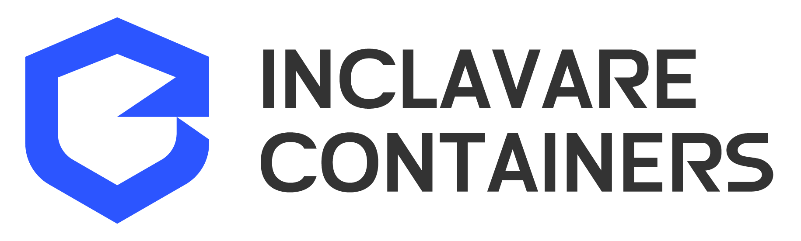

[](https://github.com/alibaba/inclavare-containers/actions?query=workflow%3A%22Nightly+Ubuntu+SGX1%22)
[](https://github.com/alibaba/inclavare-containers/actions?query=workflow%3A%22Nightly+CentOS+SGX1%22)

Inclavare Containers is an innovation of container runtime with the novel approach for launching protected containers in hardware-assisted Trusted Execution Environment (TEE) technology, aka Enclave, which can prevent the untrusted entity, such as Cloud Service Provider (CSP), from accessing the sensitive and confidential assets in use.

Inclavare Containers has the following salient features:

- Confidential computing oriented. Inclavare Containers provides a general design for the protection of tenant’s workload. 
  - Create the hardware-enforced isolation between tenant’s workload and privileged software controlled by CSP.
  - Remove CSP from the Trusted Computing Base (TCB) of tenant in untrusted cloud.
  - Construct the general attestation infrastructure to convince users to trust the workloads running inside TEE based on hardware assisted enclave technology.
- OCI-compliant. The component `rune` is [fully compliant](https://github.com/opencontainers/runtime-spec/blob/master/implementations.md#runtime-container) with OCI Runtime specification.
- Cloud platform agnostic. It can be deployed in any public cloud Kubernetes platform.

Please refer to [Terminology](docs/design/terminology.md) for more technical expressions used in Inclavare Containers.

# Audience

Inclavare Containers is helping to keep tenants' confidential data secure so they feel confident that their data is not being exposed to CSP or their own insiders, and they can easily move their trusted applications to the cloud.

# Architecture

Inclavare Containers follows the classic container runtime design. It takes the adaption to [containerd](https://github.com/containerd/containerd) as first class, and uses dedicated [shim-rune](https://github.com/alibaba/inclavare-containers/tree/master/shim) to interface with OCI Runtime [rune](https://github.com/alibaba/inclavare-containers/tree/master/rune). In the downstrem, [init-runelet](docs/design/terminology.md#init-runelet) employs a novel approach of launching [enclave runtime](docs/design/terminology.md#enclave-runtime) and trusted application in hardware-enforced enclave.


The major components of Inclavare Containers are:

- rune  
  rune is a CLI tool for spawning and running enclaves in containers according to the OCI specification. rune is already written into [OCI Runtime implementation list](https://github.com/opencontainers/runtime-spec/blob/master/implementations.md#runtime-container).

- shim-rune  
  shim-rune resides in between containerd and `rune`, conducting enclave signing and management beyond the normal `shim` basis. In particular shim-rune and `rune` can compose a basic enclave containerization stack for confidential computing, providing low barrier to the use of confidential computing and the same experience as ordinary container. Please refer to [this doc](shim/README.md) for the details.

- enclave runtime  
  The backend of `rune` is a component called enclave runtime, which is responsible for loading and running trusted and protected applications inside enclaves. The interface between `rune` and enclave runtime is [Enclave Runtime PAL API](rune/libenclave/internal/runtime/pal/spec.md), which allows invoking enclave runtime through well-defined functions. The softwares for confidential computing may benefit from this interface to interact with cloud-native ecosystem.  
  
  One typical class of enclave runtime implementations is based on Library OSes. Currently, the recommended enclave runtime interacting with `rune` is [Occlum](https://github.com/occlum/occlum), a memory-safe, multi-process Library OS for Intel SGX.  And another typical class of enclave runtime is [WebAssembly Micro Runtime (WAMR)](https://github.com/bytecodealliance/wasm-micro-runtime) with Intel SGX, a standalone WebAssembly (WASM) runtime with a small footprint, including a VM core, an application framework and a dynamic management for WASM applications.
  
  In addition, you can write your own enclave runtime with any programming language and SDK (e.g, [Intel SGX SDK](https://github.com/intel/linux-sgx)) you prefer as long as it implements Enclave Runtime PAL API.

# Non-core components 

- sgx-tools  
  sgx-tools is a CLI tool, used to interact Intel SGX AESM service to retrieve various materials such as launch token, quoting enclave's target information, enclave quote and remote attestation report from IAS. Refer to [this tutorial](sgx-tools/README.md) for the details about its usage.

- epm  
  epm is a service that is used to manage the cache pools to optimize the startup time of enclave. Refer to [this tutorial](epm/README.md) for the details about its usage.

# Roadmap

Please refer to [Inclavare Containers Roadmap](ROADMAP.md) for the details. This document outlines the development roadmap for the Inclavare Containers project.

# Building

Please follow the command to build Inclavare Containers from the latested source code on your system. 

1. Download the latest source code of Inclavare Containers

```shell
mkdir -p "$WORKSPACE"
cd "$WORKSPACE"
git clone https://github.com/alibaba/inclavare-containers
```

2. Install the Dependency required by Inclavare Containers
- Go version 1.14 or higher.
- `libseccomp`.
- [SGX DCAP](https://github.com/intel/SGXDataCenterAttestationPrimitives): please download and install the rpm(centos) or deb(ubuntu) from "https://download.01.org/intel-sgx/sgx-dcap/#version#linux/distro"
	- libsgx-dcap-quote-verify: both for centos and ubuntu
	- libsgx-dcap-quote-verify-dev(ubuntu) or libsgx-dcap-quote-verify-devev(centos)

3. Build Inclavare Containers

```shell
cd inclavare-containers
# build rune, shim-rune, epm and sgx-tools
make
```

# Installing

After build Inclavare Containers on your system, you can use the following command to install Inclavare Containers on your system.

```shell
sudo make install
```

`{rune,shim-rune,epm,sgx-tools}` will be installed to `/usr/local/bin/{rune,containerd-shim-rune-v2,epm,sgx-tools}` on your system.

If you don't want to build and install Inclavare Containers from latest source code. We also provide RPM/DEB repository to help you install Inclavare Containers quickly. Please see the [steps about how to configure repository](https://github.com/alibaba/inclavare-containers/blob/master/docs/create_a_confidential_computing_kubernetes_cluster_with_inclavare_containers.md#1-add-inclavare-containers-repository) firstly. Then you can run the following command to install Inclavare Containers on your system.

- On CentOS 8.1

```shell
sudo yum install rune shim-rune epm sgx-tools
```

- On Ubuntu 18.04 server

```
sudo apt-get install rune shim-rune epm sgx-tools
```

# Integrating

Inclavare Containers can be integrated with dockerd, containerd, and [pouchd](https://github.com/alibaba/pouch).

The former targets using docker to deploy Inclavare Containers. Specifically, you need to install the preferred enclave runtime when building container images, and then launch the enclave runtime through `rune` and [enclave runtime specific PAL](docs/design/terminology.md#enclave-runtime-pal).

The latter targets using K8s to deploy Inclavare Containers. In this scenario, `shim-rune` and `rune` can compose an enclave containerization stack, so enclave runtime is not required and installed when building container images, providing with the same experience as ordinary containers.

## dockerd

Add the assocated configurations for `rune` in dockerd config file, e.g, `/etc/docker/daemon.json`, on your system.

```json
{
        "runtimes": {
                "rune": {
                        "path": "/usr/local/bin/rune",
                        "runtimeArgs": []
                }
        }
}
```

then restart dockerd on your system.

You can check whether `rune` is correctly enabled or not with:

```shell
docker info | grep rune
```

## containerd 

Inclavare Containers is added to the [adopters list of containerd](https://github.com/containerd/containerd/blob/master/ADOPTERS.md). Besides, `shim-rune` supports [containerd shim v2 API](https://github.com/containerd/containerd/blob/master/runtime/v2/task/shim.proto). So you can add the assocated configurations for `shim-rune` in the `containerd` config file, e.g, `/etc/containerd/config.toml`, on your system.

```toml
        [plugins.cri.containerd]
          ...
          [plugins.cri.containerd.runtimes.rune]
            runtime_type = "io.containerd.rune.v2"
```

then restart containerd on your system.

## pouchd

Add the assocated configurations in pouchd config file, e.g, `/etc/pouch/config.json`, on your system.

```json
	"add-runtime": {
		"rune": {
            		"path": "/usr/local/bin/rune",
            		"runtimeArgs": null,
            		"type": "io.containerd.rune.v2"
        	},
		...
	}	
```

where:
- @path: specify the path of OCI Runtime, such as the pach of `rune`.
- @runtimeArgs: specify the arguments of the pouchd runtime, such as `--platform`, `--network`.
- @type: specify the shim template from the following candidates:
	- io.containerd.rune.v2: correspond to shim-rune
	- io.containerd.runtime.v1.linux: correspond to containerd-shim
	- io.containerd.runc.v1: correspond to containerd-shim-runc-v1

then restart pouchd on your system.

You can check whether `rune` is correctly enabled or not with:

```shell
pouch info | grep rune
```

# Deployment

Inclavare Containers can be deployed with Occlum LibOS and WebAssembly Micro Runtime (WAMR).

## Occlum LibOS

Please refer to [this guide](https://github.com/occlum/occlum/blob/master/docs/rune_quick_start.md) to run [Occlum](https://github.com/occlum/occlum) with `rune` and docker.

Please refer to [this guide](docs/develop_and_deploy_hello_world_application_in_kubernetes_cluster.md) to deploy an enclave container in a Kubernetes cluster. Currently, [Hello-world application image](https://hub.docker.com/r/inclavarecontainers/occlum-hello-world) and web application images based on [OpenJDK 11](https://hub.docker.com/r/inclavarecontainers/occlum-java-web), [Dragonwell](https://hub.docker.com/r/inclavarecontainers/occlum-dragonwell-web), and [Golang](https://hub.docker.com/r/inclavarecontainers/occlum-golang-web) are provided. These images don't contain enclave runtime. They are only used for the deployment with containerd.

Please refer to [this guide](docs/running_inclavare_containers_with_pouch_and_occlum.md) to run inclavare-containers with `pouchd`.

## WebAssembly Micro Runtime (WAMR)

Please refer to [this guide](https://github.com/bytecodealliance/wasm-micro-runtime/tree/main/product-mini/platforms/linux-sgx/enclave-sample/App#wamr-as-an-enclave-runtime-for-rune) to run [WAMR](https://github.com/bytecodealliance/wasm-micro-runtime) with `rune`.

[WebAssembly Micro Runtime (WAMR) application image](https://hub.docker.com/r/inclavarecontainers/enclave-wamr/tags) is provided. WAMR image contains enclave runtime, because it doesn't adapt to shim-rune and use off-cloud signing. It is only used for the deployment with dockerd.
