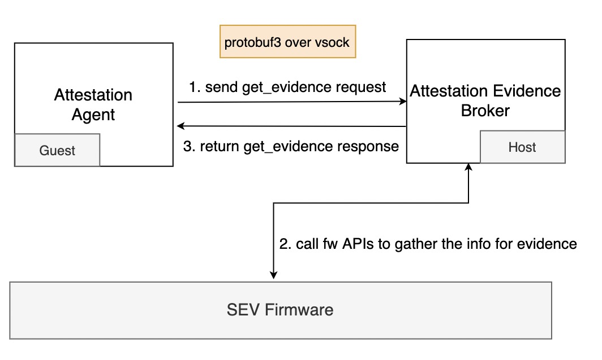

This document provides how to use Attestation Evidence Broker (AEB) which is a host service to satisfy the requests from guest for getting runtime attestation report.

Currently, AEB only supports SEV(-ES) runtime attestation.

# Background

Compared with SEV-SNP and Intel TDX, the runtime attestation of SEV(-ES) does NOT support guest-provided data included in the attestation report [1,2]. In addition, SEV(-ES) also does NOT support the dynamic measurement. During runtime, it can only generate static attestation report with the constant launch digest reflecting the initial measurement. Although SEV(-ES) has above limitations, its runtime attestation is still useful. When the SEV(-ES) guest is running, it can report the attestation report with fixed launch digest as a heartbeat for trusted healthy check.

SEV(-ES) runtime attestation includes two participants: attester and verifier.

- The attester running in a SEV(-ES) guest is responsible for collecting attestation evidence.
- The verifier running in a trusted environment is responsible for verifying the attestation evidence provided by the attester. Note that **the verifier can run on any platform even non-TEE**.

# SEV(-ES) Attestation Evidence

Verifier uses the following SEV(-ES) certificate chains to verify the signature of the attestation report generated by the `ATTESTATION` command [2]:

```bash
certificate chain for device identity: ARK -> ASK -> CEK -> PEK -> report
certificate chain for platform owner identity: OCA -> PEK -> report
```

- `foo -> bar` indicates using the public key of `foo` to verify the signature of `bar`.
- ARK is the root of trust of AMD and OCA is the root of trust for platform owners. OCA has two ways:
    1. Self-owned: The OCA Key Pair and self-signed OCA certificate are automatically generated by the SEV(-ES) firmware.
    2. Externally-owned: External users use OCA Key Pair to generate self-signed OCA certificates in a trusted environment.

Verifier needs to verify the attestation report with the certificate chain. ARK and ASK can be obtained directly from the AMD KDS server. CEK, PEK, OCA, and attestation report are related to the specific SEV(-ES) platform, therefore **SEV(-ES) Attestation Evidence collected by attester should include attestation report (with the constant launch digest), PEK, CEK, and OCA certificate.**

| Contents of SEV(-ES) Attestation Evidence | SEV(-ES) firmware command |
| :-: | :-: |
| attestation report                        | ATTESTATION               |
| CEK                                       | GET_ID                    |
| OCA,PEK                                   | PDH_CERT_EXPORT           |

## Query SEV(-ES) Attestation Evidence

According to the [official feedback](https://github.com/AMDESE/AMDSEV/issues/71#issuecomment-926118314), **SEV(-ES) firmware APIs don't support query attestation report in SEV(-ES) guest and there is no plan to support it in the future. Instead, this capability will be available in SEV-SNP.**

In some scenarios, the guest application needs to query the attestation report to establish an attested channel with the remote peer. There are two approaches for a guest application to query an attestation evidence:

- Hypercall approach
- VSOCK approach

Considering time and cost, we only need to implement one of them.

### Hypercall approach

SEV(-ES) guest exits to VMM using `hypercall` and then interacts with SEV firmware to query the components composing an attestation evidence, including attestation report, PEK, CEK, OCA certificate. To build an attestation evidence, the steps include:

1. The guest application requests a shared memory page, initiates a hypercall, and switches from the guest mode to the host mode.
2. In the host mode, KVM sends the `GET_ID, PDH_CERT_EXPORT, ATTESTATION` command requests to SEV firmware.
3. The shared memory page is filled with the data returned by the SEV firmware.
4. The guest application can obtain attestation evidence by reading the data in the shared memory.

Although this method can meet our requirements, it requires a lot of modifications to the guest kernel and KVM.

### VSOCK approach

In the current implementation, QEMU provides the QMP interface "query-sev-attestation-report" to query the attestation report in the host. The report is signed by PEK and contains the SHA-256 digest of the guest memory and VMSA encrypted with the LAUNCH_UPDATE. However, QEMU is not the only VMM. In order to support various VMM in different scenarios, it is necessary to design a general service to query attestation evidence from the host.

The workflow of AEB is as followed:



1. The user-level application in the guest sends a request (including guest firmware handle) to AEB through VSOCK.
2. AEB requests to query attestation report, PEK, CEK, OCA certificate by calling multiple SEV firmware APIs (refer to the table above for specific API commands) and assembles these information into the attestation evidence.
3. AEB returns the attestation evidence to the application in the guest.

In order to work out AEB, please manually apply [these patches](https://github.com/haosanzi/attestation-evidence-broker/tree/master/hack). Here are the workflows:

1. It is necessary to add a `SEV_GET_REPORT` interface in ccp driver so that AEB can execute `ioctl` on the `/dev/sev` device and then call the `SEV_GET_REPORT` interface to send the `ATTESTATION` command to the SEV firmware to query attestation report.

2. In order to obtain the guest handle required by the `ATTESTATION` command to the SEV firmware, a new hypercall needs to be added to the KVM. The application in the guest obtains the guest handle through this newly added hypercal, and then sends it to the AEB service through VSOCK. The AEB service uses the guest handle as the input parameter of the `ATTESTATION` command to interact with the SEV firmware.

Note that hypercall is not the only way to obtain the guest handle. Actually the qmp interface `query-sev` can query the guest handle as well. However, as mentioned previously, qemu is not the only VMM.

# Communication protocol

Below is the communication protocol between the guest application and AEB.

```protobuf
syntax = "proto3";

...

message RetrieveAttestationEvidenceSizeRequest{
    uint32 guest_handle = 1;
}

message RetrieveAttestationEvidenceRequest{
    uint32 guest_handle = 1;
    uint32 evidence_size = 2;
}

message RetrieveAttestationEvidenceSizeResponse{
    uint32 error_code = 1;
    uint32 evidence_size = 2;
}

message RetrieveAttestationEvidenceResponse{
    uint32 error_code = 1;
    uint32 evidence_size = 2;
    bytes evidence = 3;
}

service AEBService {
    rpc RetrieveAttestationEvidenceSize(RetrieveAttestationEvidenceSizeRequest) returns (RetrieveAttestationEvidenceSizeResponse);
    rpc RetrieveAttestationEvidence(RetrieveAttestationEvidenceRequest) returns (RetrieveAttestationEvidenceResponse);
}
```

# Application scenario

## Enclave Attestation Architecture (EAA)

EAA is a universal and cross-platform remote attestation architecture for cloud scenarios. EAA's Verdictd is a remote attestation implementation comprising of a set of building blocks that utilize Intel/AMD Security features to discover, attest, and enable critical foundation security and confidential computing use-cases. Please refer [design doc](https://github.com/alibaba/inclavare-containers/blob/master/verdictd/docs/design/design.md) to view the design of verdictd.

In practice, Verdictd creates an m-TLS(Mutal Transport Layer Security) connection with Attestation Agent running in the SEV(-ES) guest via remote attestation. Attestation Agent(AA) will fetch SEV(-ES) signed attestation evidence by querying AEB service and send it to Verdictd. Verdictd will check the evidence's signature to ensure the AA's running environment can be trusted (truly HW-TEE).

# Reference

[1] https://www.amd.com/system/files/TechDocs/55766_SEV-KM_API_Specification.pdf  
[2] https://www.amd.com/system/files/TechDocs/56860.pdf  
