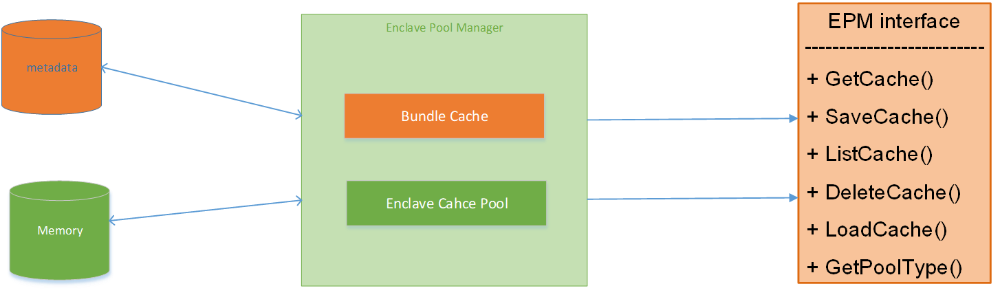
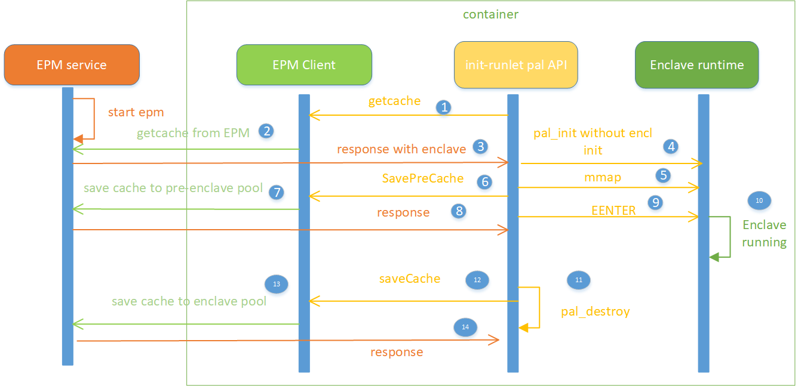
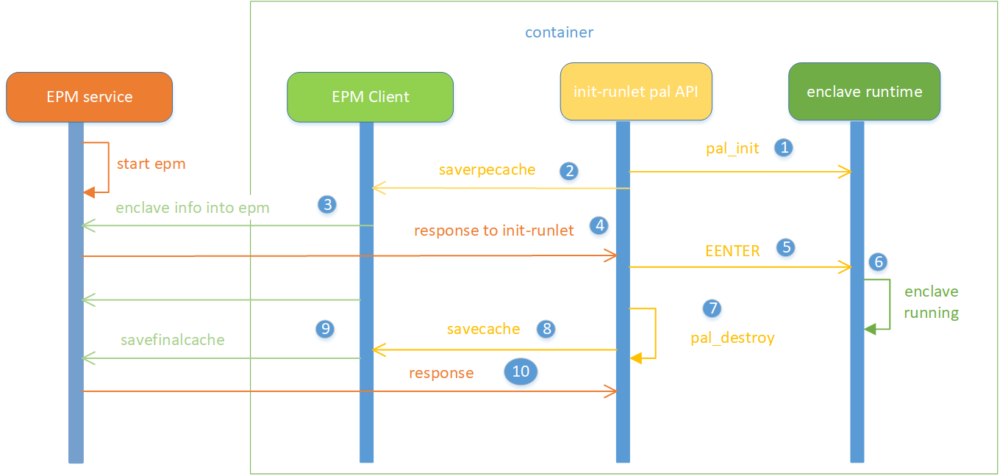
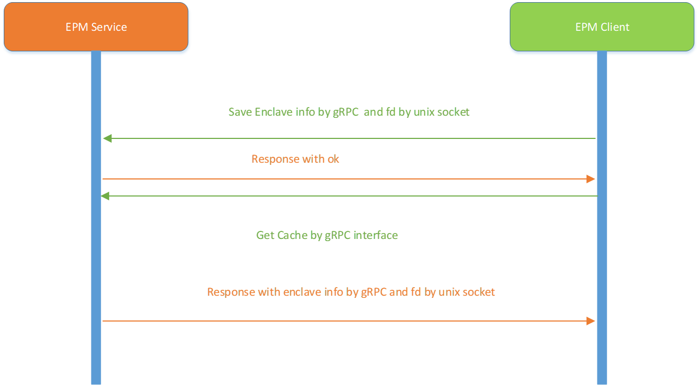
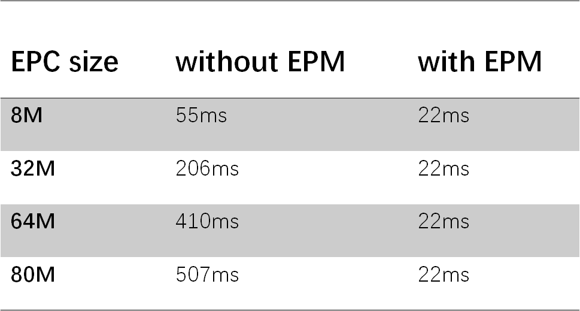

# Overview

This document introduces EPM fundamental and design. EPM is a module optimized enclave boot time. It is designed as two parts, one is OCI bundles cache management, the other one is enclave cache pool management. This documentation will focus on enclave cache pool management currently, briefly call it as [EPM](https://github.com/alibaba/inclavare-containers/blob/master/epm) as below.

The EPM is used to cache enclaves which can store various enclave runtime, e.g. [skeleton](https://github.com/alibaba/inclavare-containers/tree/master/rune/libenclave/internal/runtime/pal/skeleton), [Graphene](https://github.com/oscarlab/graphene) (under plan), [Occlum](https://github.com/occlum/occlum)(under development). Current implementation is based on skeleton. Inclavare-containers provides skeleton as an enclave runtime reference.

EPM includes EPM service and EPM client sorted by function.

- EPM service is used to store the enclave info and as gRPC server implementing EPM interface. There are two communicating channels between EPM service and EPM client. Channel one is used by gRPC as function calling. Channel two is used by transferring enclave file descriptor between both processes. EPM service will listen on epm.sock in unix socket. It will receive the gRPC calling from EPM client.
- The EPM client can collect the enclave’s info by procfs and transfer skeleton enclave info to enclave pool cache in EPM service. Skeleton enclave info includes enclave base address, enclave descriptor file, enclave memory layout, permissions.

In Enclave runtime pal API will be used to manage enclave runtime lifecycle. Pal API V3 provides EPM reference implementation.

# Design and Implementation

## EPM Service Design

  EPM service is a process running on host machine. It implements cache pool interface.



EPM service has capability of storing the enclave info, the storing is split into two parts:

The enclave file descriptor just can be transferred with the same process who is opening the enclave. This is why to use two stages of storing.

- pre-storing

In pre-storing state, the enclave info is not valid to be used, it just saves the enclave fd to `var EnclavePoolPreStore map[string]*v1alpha1.Enclave` in EPM service by unix domin socket with `sendFd`/`recvFd`.
- final-storing

Once the enclave is released by `pal_destroy` in container, the enclave info except enclave fd will be transferred by gRPC interface to `var EnclavePoolStore map[int]*v1alpha1.Enclave` in EPM service. The `pal_destroy` will call gRPC interface `SaveFinalCache` to sync with the EPM service, until now the enclave info will be available for other containers.

When other container is started, `pal_init` will try to query and get an enclave from enclave pool by gRPC interface. If the enclave pool is not empty, the enclave info will be responded to EPM client. After mmap with parameter enclave file descriptor and enclave map address, the enclave will be valid to container.

## EPM Service implementation

### EPM service process

EPM is started as a process on host. It’s based on gRPC inter-process communicating. EPM service is started by command line: sudo epm. It will create and listen on /var/run/epm/epm.sock as following:

```go
enclmanager := enclavepool.NewEnclaveCacheManager(cfg.Root)
// register process cache pool manager to the manager server
server.RegisterCachePoolManager(enclmanager)
// start the grpc server with the server options
s := grpc.NewServer(serverOpts...)
// registry and start the cache pool manager server
v1alpha1.RegisterEnclavePoolManagerServer(s, &server)
// listen and serve
lis, err := net.Listen("unix", cfg.GRPC.Address)
s.Serve(lis)
```

### Enclave and cache pool structure

1. Enclave proto definition:

```protobuf
message Enclave {
        int64 fd = 1; // Enclave file descriptor in current process
        int64 nr = 2; // Enclave memory segment numbers
        repeated Enclavelayout layout = 3; // Enclave memory layout
}
message Enclavelayout {
        uint64 addr = 1; // Current enclave segment starting address
        uint64 size = 2; // Current enclave segment size
        EnclavePerms prot = 3; // Current enclave segment’s permission
}
message EnclavePerms {
        bool read = 1;
        bool write = 2;
        bool execute = 3;
        bool share = 4;
        bool private = 5;
}
```

2. Cache and Cache Pool:
Cache represents the metadata of a cache managed by enclave pool.

```protobuf
message Cache {
    string type = 1; // Type represents the type of enclave pool
    string subType = 2; // SubType represents the subtype of enclave pool which represents a more find-grained pool
    string ID = 3; // ID represents the id of the cache and the id is unique in the same type of enclave pool
    string savePath = 4; // SavePath represents the absolute path to store the cache
    Cache parent = 5; // Parent represents the parent cache of the current cache, if do not have a parent the value is nil
    int64 size = 6; // Size represents the size in bytes of the cache
    int64 created = 7; // Created represents the creation time of the cache which is the number of seconds elapsed since January 1, 1970 UTC
    google.protobuf.Any options = 8; // Options is an optional field which can extend any type of data structure
}
```

3. EnclavePoolManager
EnclavePoolManager represents an enclave pool.

```protobuf
service EnclavePoolManager {
    // GetCache represents get the specified cache from pool
    rpc GetCache(GetCacheRequest) returns (GetCacheResponse) {}
    // PickCache represents pick a suitable cache from pool
    rpc PickCache(PickCacheRequest) returns (PickCacheResponse){}
    // SaveCache represents save the data to a cache directory and record the cache metadata
    rpc SaveCache(SaveCacheRequest) returns (SaveCacheResponse) {}
    // SaveFinalCache represents save the enclave info which can be used instantly
    rpc SaveFinalCache(SaveCacheRequest) returns (SaveCacheResponse) {}
    // ListCache represents list part of or all of the cache metadata
    rpc ListCache(ListCacheRequest) returns (ListCacheResponse) {}
    // DeleteCache represents delete the specified cached data and remove the corresponding cache metadata
    rpc DeleteCache(DeleteCacheRequest) returns (DeleteCacheResponse) {}
    // LoadCache represents load the specified cache data to work directory
    rpc LoadCache(LoadCacheRequest) returns (LoadCacheResponse) {}
}
```

Enclave info will be stored into the map variant temporarily after `pal_init`.

```go
var EnclavePoolPreStore map[string]*v1alpha1.Enclave
```

Enclave info will be stored into the map variant finally after `pal_destroy`.

```go
var EnclavePoolStore map[int]*v1alpha1.Enclave
```

Each enclave manager will implement the following interface, currently we just have one type of enclave runtime, we implement it in enclave-cache.go

4. EnclavePool interface

EnclavePool represents one type of enclave pool, each kind of enclave pool need implement the EnclavePool interface.

```go
type EnclavePool interface {
        // GetCache gets the cache by ID
        GetCache(ID string) (*v1alpha1.Cache, error)
        // SaveCache saves the data to a cache directory and record the cache metadata
        SaveCache(sourcePath string, cache *v1alpha1.Cache) error
        // SaveFinalCache save the final enclave cache info
        SaveFinalCache(ID string) error
        // ListCache lists part of or all of the cache metadata
        ListCache(lastCacheID string, limit int32) ([]*v1alpha1.Cache, error)
        // DeleteCache deletes the specified cached data and remove the corresponding cache metadata
        DeleteCache(ID string) error
        // LoadCache loads the specified cache data to work directory
        LoadCache(ID, targetPath string) error
        // GetPoolType gets the pool type of current pool
        GetPoolType() string
}
```

5. DefaultEnclavePool

DefaultEnclavePool is the default implementation of EnclavePool

```go
type DefaultEnclavePool struct {
        Root          string
        Type          string
        Enclaveinfo   map[int]*v1alpha1.Enclave
        CacheMetadata *cache_metadata.Metadata
}
```

### Enclave cache pool operation

We just need implement two interfaces:

```go
func (d *EnclaveCacheManager) GetCache(ID string) (*v1alpha1.Cache, error)
```

This function will marshal enclave info in cache pool, and then `sendFd` enclave file descriptor to the receiving process init-runelet in container. By `sendFd`, the enclave file descriptor will be dup to init-runelet process in container which will create and map the enclave by enclave info.



```go
func (d *EnclaveCacheManager) SaveCache(sourcePath string, cache *v1alpha1.Cache) error
```

SaveCache represents enclave info will be saved into EnclavePoolStore, the control flow is as below:



## EPM client implementation



### Save enclave from EPM client to EPM service:

1. Analyze /proc/self/maps, get device /dev/sgx/enclave’s mapping info(address, size, permission, flag)
2. Query /proc/self/fd, get device /dev/sgx/enclave’s fd
3. GRPC those info above to EPM service, but enclave fd is sent by `sendFd` in unix socket.

### Get enclave from EPM service to EPM client:

1. Calling GetCache in `pal_init`, The GetCache function will go into EPM service by gRPC.
2. cacheResp will be responded with cache info from EPM service to EPM client. Enclave fd will be returned by `sendFd`/`recvFd`. Enclave info will be composed of cacheResp and enclave fd.

## Enclave Runtime PAL API

[Enclave Runtime PAL API](https://github.com/alibaba/inclavare-containers/blob/master/rune/libenclave/internal/runtime/pal/spec.md#enclave-runtime-pal-api-specification) defines a common interface to interact between rune and enclave runtime.Enclave Runtime PAL API Specification currently supports PAL API V1 V2 V3. Only V3 can support EPM.

Let’s take skeleton as an example.

int `pal_init(pal_attr_v3_t *attr)` definition in rune/libenclave/internal/runtime/pal/skeleton/liberpal-skeleton.h. The `pal_init` takes responsibility for creating, loading, measuring and initializing enclave.

```go
typedef struct {
        pal_attr_v1_t attr_v1;
        int fd;
        uint64_t addr;
} pal_attr_v3_t;
```

At early stage of `pal_init`, the 'epm.GetEnclave()' will try to query enclave from EPM service.  If the value returned is not empty, it will filled `pal_attr_v3_t` structure. it means that enclave is retrieved from the enclave cache pool. `Pal_init` will be done instantly.

# Performance testing

We have a performance testing based on skeleton as below:

From `pal_init` to `pal_destroy`, an enclave runtime's lifecycle.


