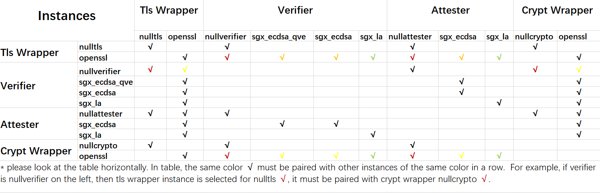

# Building

## Build Requirements

- git
- make
- autoconf
- libtool
- gcc
- g++ (ubuntu 18.04) or gcc-c++ (centos 8.2)
- SGX driver, Intel SGX SDK & PSW: Please refer to this [guide](https://download.01.org/intel-sgx/latest/linux-latest/docs/Intel_SGX_Installation_Guide_Linux_2.13_Open_Source.pdf) to install.
- [SGX DCAP](https://github.com/intel/SGXDataCenterAttestationPrimitives): please download and install the packages from this [page](https://download.01.org/intel-sgx/sgx-dcap/#version#linux/distro).
  - centos 8.2: `libsgx-dcap-quote-verify-devel`, `libsgx-dcap-ql-devel`, `libsgx-uae-service`
  - ubuntu 18.04: `libsgx-dcap-quote-verify-dev`, `libsgx-dcap-ql-dev`, `libsgx-uae-service`

## Build and Install

Please follow the command to build Enclave TLS from the latested source code on your system.

1. Download the latest source code of Enclave TLS

```shell
mkdir -p "$WORKSPACE"
cd "$WORKSPACE"
git clone https://github.com/alibaba/inclavare-containers
```

2. Build and install Enclave TLS

```shell
cd inclavare-containers/enclave-tls
make
make install
```

`{enclave-tls-server,enclave-tls-client}` will be installed to `/usr/share/enclave-tls/samples/{enclave-tls-server,enclave-tls-client}` on your system. All instances are placed in `/opt/enclave-tls/lib`.

If you want to build instances related to sgx(sgx\_ecdsa, sgx\_ecdsa\_qve, sgx\_la), please type the following command.

```shell
make SGX=1
```

Note that [SGX LVI mitigation](https://software.intel.com/security-software-guidance/advisory-guidance/load-value-injection) is enabled by default. You can set macro `SGX_LVI_MITIGATION` to `0` to disable SGX LVI mitigation.

# RUN

Right now, Enclave TLS supports the following instance types:

| Priority | Tls Wrapper instances |     Attester instances     |     Verifier instances     | Crypto Wrapper Instance |
| -------- | --------------------- | -------------------------- | -------------------------- | ----------------------- |
| low      | nulltls               | nullattester               | nullverifier               | nullcrypto              |
| Medium   | openssl               | sgx\_la                    | sgx\_la                    | openssl                 |
| High     |                       | sgx\_ecdsa                 | sgx\_ecdsa sgx\_ecdsa\_qve |                         |

By default,  Enclave TLS will select the **highest priority** instance to use.

The following instances matrix will introduce possible combinations between each instances.



## Run enclave tls server
```
cd /usr/share/enclave-tls/samples
./enclave-tls-server
```

## Run enclave tls client
```
cd /usr/share/enclave-tls/samples
./enclave-tls-client
```

## Specify the instance type

The options of enclave-tls-server are as followed:  

```shell
OPTIONS:
   --attester/-a value   set the type of quote attester
   --verifier/-v value   set the type of quote verifier
   --tls/-t value        set the type of tls wrapper
   --crypto/-c value     set the type of crypto wrapper
   --mutual/-m           set to enable mutual attestation
   --log-level/-l        set the log level
   --ip/-i               set the listening ip address
   --port/-p             set the listening tcp port
   --product-enclave/-P  set to enable product enclave
```

You can set command line parameters to specify different configurations.

For example:

```shell
./enclave-tls-server --tls openssl
./enclave-tls-server --attester sgx_ecdsa
./enclave-tls-server --attester sgx_ecdsa_qve
./enclave-tls-server --attester sgx_la
./enclave-tls-server --crypto openssl
```

Enclave TLS's log level can be set through `-l` option with 6 levels: `off`, `fatal`, `error`, `warn`, `info`, and `debug`. The default level is `error`. The most verbose level is `debug`.

For example:

```
./enclave-tls-server -l debug
```

Enclave TLS server binds `127.0.0.1:1234` by default. You can use `-i` and `-p` options to set custom configuration.

```shell
./enclave-tls-server -i [ip_addr] -p [port]
```

## Mutual attestation

You can use `-m` option to enable mutual attestation.

```shell
./enclave-tls-server -m
./enclave-tls-client -m
```

## Enable bootstrap debugging

In the early bootstrap of enclave-tls, the debug message is mute by default. In order to enable it, please explicitly set the environment variable `ENCLAVE_TLS_GLOBAL_LOG_LEVEL=<log_level>`, where \<log_level\> is same as the values of the option `-l`.

# Deployment

## Occlum LibOS

Please refer to [this guide](docs/run_enclave_tls_with_occlum.md) to run Enclave Tls with [Occlum](https://github.com/occlum/occlum) and [rune](https://github.com/alibaba/inclavare-containers/tree/master/rune).

## Non-SGX Enviroment

In non-sgx enviroment, it's possible to show the error messages as below when running the command `./enclave-tls-client --attester sgx_ecdsa`. According to Intel DCAP's implementation, when calling to sgx_qv_get_quote_supplemental_data_size(),
if the libsgx_urts library is present, it will try to load QvE firstly. If failed, the verification will be launched by QVL. So the error info can be ignored and have no impact on the final attestation result.

```
[load_qve ../sgx_dcap_quoteverify.cpp:209] Error, call sgx_create_enclave for QvE fail [load_qve], SGXError:2006.
[sgx_qv_get_quote_supplemental_data_size ../sgx_dcap_quoteverify.cpp:527] Error, failed to load QvE.
```

# Third Party Dependencies

Direct Dependencies

| Name | Repo URL | Licenses |
| :--: | :-------:   | :-------: |
| openssl | https://github.com/openssl/openssl | Apache |
| linux-sgx | https://github.com/intel/linux-sgx | BSD-3-clause |
| SGXDataCenterAttestationPrimitives | https://github.com/intel/SGXDataCenterAttestationPrimitives | BSD-3-clause |
| GNU C library | C library | GNU General Public License version 3 |
