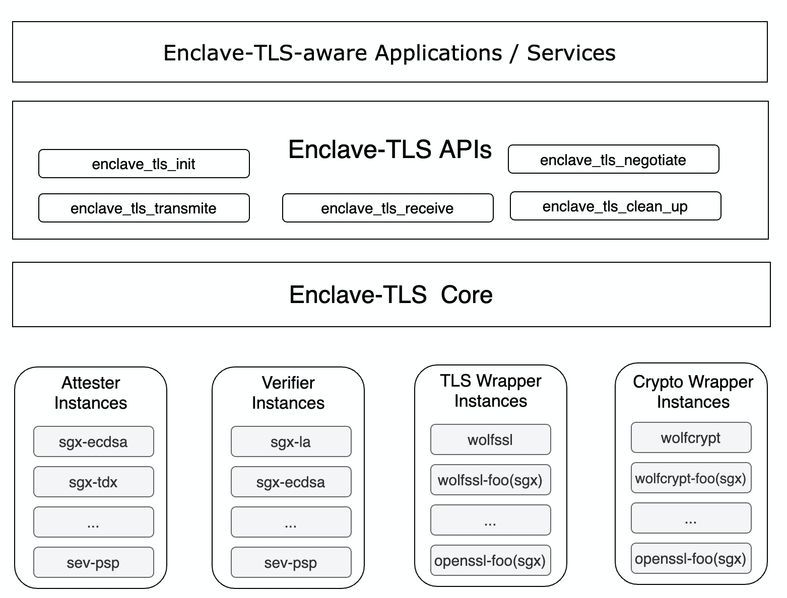
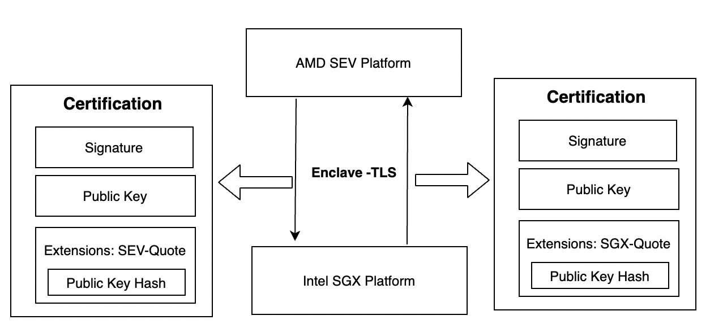
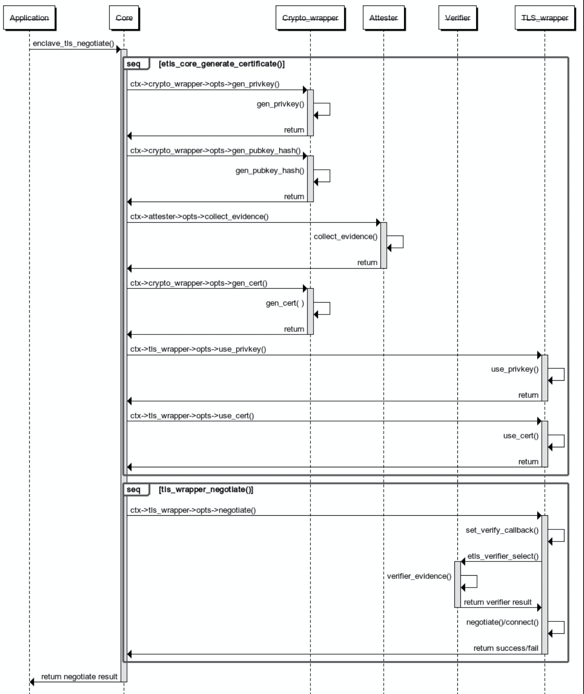
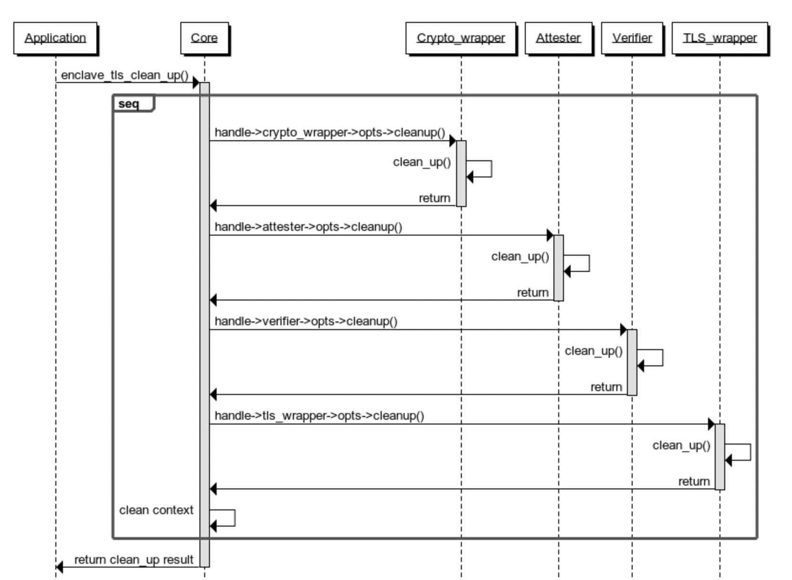

# Table of Content

- [Introduction](#introduction)
- [Overview](#overview)
  - [Use hardware as the root of trust to extend the data security boundary](#use-hardware-as-the-root-of-trust-to-extend-the-data-security-boundary)
  - [Secure and trusted communication of heterogeneous HW-TEE nodes](#secure-and-trusted-communication-of-heterogeneous-hw-tee-nodes)
  - [Modular design with strong scalability](#modular-design-with-strong-scalability)
- [Work process](#work-process)
  - [Initialization stage](#initialization-stage)
  - [Running stage](#running-stage)
- [Instances design](#instances-design)
  - [TLS Wrapper instance](#tls-wrapper-instance)
  - [Enclave Attester instance](#enclave-attester-instance)
  - [Enclave Verifier instance](#enclave-verifier-instance)
  - [Crypto Wrapper instance](#crypto-wrapper-instance)
- [Application scenario](#application-scenario)
  - [Enclave Attestation Architecture](#enclave-attestation-architecture-eaa)
- [Reference](#reference)

---

[Chinese Version/中文版本](design-zh.md)

# Introduction

Data has three states throughout its life cycle: At-Rest (static), In-Transit (transmitting), and In-Use (in use). In computing, data exists in three states: in transit, at rest, and in use. Data traversing the network is "in transit", data in storage is "at rest", and data being processed is "in use". In a world where we are constantly storing, consuming, and sharing sensitive data - from credit card data to medical records, from firewall configurations to our geolocation data -protecting sensitive data in all of its states is more critical than ever. Cryptography is now commonly deployed to provide both data confidentiality (stopping unauthorized viewing) and data integrity (preventing or detecting unauthorized changes). While techniques to protect data in transit and at rest are now commonly deployed, the third state - protecting data in use - is the new frontier[1].

**Confidential Computing is the protection of data in use using hardware-based Trusted Execution Environments.** Through the use of Confidential Computing, we are now able to provide protection against "in use" data.

In general, the applications running in the Hardware Trusted Execution Environment (HW-TEE) are trusted, including the TLS library, so it seems that there is no need to give special consideration to the TLS library in the HW-TEE. However, the peer communicating with the HW-TEE must verify whether the workload is running in the real HW-TEE. The conventional remote attestation engineering practice only encapsulates the underlying primitives of remote attestation. The actual output is to enable the communicating parties to negotiate a shared secret safely and credibly and leave the work of how to create a secure communication channel based on the shared secret to the application developer.

Studies have shown that RA and the logic of establishing a secure channel must be deeply integrated, otherwise, it is vulnerable to man-in-the-middle attacks [2]. Even if the complex protocol such as RA and TLS is not combined, at least the basic function of negotiating the shared key as the basis of the secure channel through RA protocol can be realized. Although the secure channel can be implemented based on the shared secret, the communication efficiency of the secure channel based on the RA protocol is too low. To solve this problem, the solution is to combine RA with a standard protocol that can provide a secure channel, such as the TLS protocol.

Thomas Knauth proposed an architecture that combines Intel SGX remote attestation and TLS [3], but this architecture faces the following challenges:
- How to flexibly support different TLS libraries?
- How to adapt to different HW-TEE environments?
- How to make two different types of HW-TEE mutually verify each other's Evidence?

In order to solve the above challenges, we proposed **Enclave-TLS, a mutual transport layer security protocol that supports heterogeneous hardware executable environments**. Enclave-TLS adds the ability to bind the public key in the TLS certificate to the HW-TEE attestation quote on the basis of TLS. Based on the HW-TEE hardware as the root of trust, it can prove that the other party is on a trusted platform. Data can be transmitted efficiently. At the same time, Enclave-TLS also has the following advantages:
- Able to support different HW-TEE types.
- Able to support different TLS libraries.
- Able to support different cryptographic algorithm libraries.
- Able to support mutual TLS authentication between different types of HW-TEE.

# Overview



The architecture of Enclave-TLS is shown in the figure above. Enclave TLS provides five APIs for upper-layer applications and services. The five APIs can realize the establishment of trusted and secure channels and the transmission of data. The implementation of Enclave TLS API relies on the implementation of the core layer and four types of instances.

In order to provide better security, the core layer and the four types of instance plug-ins are all running in the HW TEE environment. Since the Enclave-TLS architecture needs to support and flexibly choose multiple possibilities (for example, TLS library, Encryption library, Enclave form, etc.), it is essential to distinguish different instance plug-ins based on functional logic. The following briefly introduces the role of the core layer and instance plug-ins.
- **Enclave-TLS Core**: Responsible for the overall control role and control the flow of data flow.
- **TLS Wrapper instance**: Responsible for the real TLS session management and network transmission.
- **Attester instance**: Responsible for collecting proof materials from the local platform operating environment, usually with Enclave to generate quote data.
- **Verifier instance**: Responsible for verifying the received quote data in various formats, and may receive a quote from a different confidential computing hardware platform. There may also be cases where the verifier and attester must be on the same platform. For example, it is mandatory that the current operating environment must support SGX ECDSA when the type of verifier instance is `sgx_ecdsa_qve`, otherwise QVE cannot be launched to verify the SGX ECDSA quote.
- **Crypto instance**: Responsible for cooperating with other instances to complete operations related to cryptographic algorithms. For example it can generate self-signed cert and encapsulate quotes into cert extensions.

In total, the design of Enclave-TLS has the following features:
- Combine RA with a standard protocol that can provide a secure channel, and use hardware as the root of trust to extend the data security boundary.
- Supports secure and trusted communication of heterogeneous HW-TEE nodes, not limited to platforms.
- Modular design with strong scalability.

## Use hardware as the root of trust to extend the data security boundary

In contrast to the PKI used in the modern web where the trust root is a list of root certificate authorities
maintained by a handful of entities such as Aliyun, Google, and Microsoft, we want to use Hardware TEE (Intel SGX, AMD SEV, etc.) as a hardware root of trust. Attester needs to provide the challenger with the necessary evidence during the TLS connection stage so that the challenger can prove that the attester is running in a trusted HW-TEE (for example, Intel SGX).

In order to achieve the goal of integrating remote attestation into the TLS handshake, we must achieve two goals:

- Bind Enclave-TLS key to enclave instance.
- The server/attester must provide the necessary evidence during the TLS connection set up to convince the client/challenger that it is indeed running on the trusted HW-TEE platform.


The specific method is shown in the figure above. The client connects to the server and then during negotiation verifies the identity of the server embedded into cert. The server is the attester and the client is the challenger. The specific process is as follows:

1. The server generates a key pair and binds the public key to the enclave instance.

After the server is started, an enclave is created and a new protected key pair is generated in the enclave. Enclave-TLS includes the hash value of the public key as user data in the attestation report to bind the Enclave-TLS key and the Enclave. The report is generated by the attester and it is ensured that the report is indeed generated on the trusted HW-TEE platform. At this point, the Enclave-TLS public key is bound to the enclave instance.

2. The server generates an x.509 certificate with attestation evidence.

We introduce new X.509 extensions, each with its own unique [object identifier](https://en.wikipedia.org/wiki/Object_identifier) (OID). Adding the attestation evidence into the certificate is less intrusive than, for example, introducing a new TLS extension which
would require invasive changes to each TLS implementation. By extending the certificate, we do not require any changes to existing TLS libraries and use readily available hooks to verify the custom X.509 extensions.

Extending the certificate traditionally requires resigning it by a CA. However, since we recommend using Hardware TEE (Intel SGX, AMD SEV, etc.) as a trust root, we can simply self-sign the certificate. Instead of relying on the CA to bind the domain name to the server’s identity/key, we rely on Hardware TEE (Intel SGX, AMD SEV, etc.) to provide the identity.

The attestation evidence embedded in the Enclave-TLS certificate varies depending on the enclave attester instance. Specific information needs to refer to the remote report information of different enclave attester instances.

3. Client verifies certificate.

Client/Challenger must verify the evidence to determine the trustworthiness of the Enclave on the specific platform. The specific steps vary depending on the remote attestation method. Protocol-wise, the verification happens during the standard TLS handshake. If any of the verification steps fail, the endpoint aborts the handshake to terminate the TLS connection.

In addition, the verifier must check if the hash of the ENCLAVE-TLS certificate’s public key is present in the enclave’s report. This is how the ENCLAVE-TLS  key is tied to a particular enclave instance. Finally, the verifier compares the enclave’s identity (e.g., MRENCLAVE and MRSIGNER) against the expected identity.

## Secure and trusted communication of heterogeneous HW-TEE nodes

In some cases, the client and server can run on different confidential computing platforms, and there may be different quote types of attestation reports obtained by the server. How to effectively verify multiple types of quote instances and establish a secure channel is a problem.

In order to solve this problem, Enclave-TLS abstracts the logic of verifying different quote types into corresponding Verifier instances, distinguishes the received certificate types through Object Identifier (OID), and then selects different Verifier instances for certificate verification (The security and trusted of heterogeneous HW-TEE nodes is being implemented).

Assuming there are two platforms, AMD SEV and Intel TDX, these two platforms need to establish a mutual TLS channel. As shown in the figure below, the flow of the TLS handshake between the two platforms is as follows:

1. The AMD SEV platform generates a self-signed TLS certificate and private key in the HW-TEE and ensures that the public key of the TLS certificate is bound to the evidence generated by the HW-TEE with the hardware signature, and then sent to the Intel TDX platform for verification.

2. Intel TDX generates a self-signed TLS certificate and private key in the HW-TEE and ensures that the public key of the TLS certificate is bound to the evidence generated by the HW-TEE with the hardware signature, and then sent to the AMD SEV platform for verification.

3. The Intel TDX platform and AMD SEV platform respectively receive the TLS certificate from the opposite end. Firstly, the Intel TDX platform and AMD SEV platform use the public key of the TLS certificate to verify the integrity of the certificate, and then determine the type of quote based on the type of object identifier (OID) in the certificate, and select the corresponding verifier instance to verify the quote to ensure the credibility of the enclave on a specific platform.

4. After the verification is successed, a mutual TLS channel can be established between the two platforms.



## Modular design with strong scalability

Due to the limitation of the SGX SDK programming language, we currently put Enclave-TLS and all instances in the SGX Enclave to generate an enclave image signed by SGX, which cannot support flexible application modular. But for confidential computing encrypted virtual machines (such as AMD SEV, Intel TDX) form or SGX LibOS form, Enclave-TLS can give full play to the advantages of modular structure and strong scalability.

Enclave-TLS architecture needs to support flexibly choose multiple possibilities (for example, TLS library, Enclave form, etc.), so the use of plug-ins is essential. The entire Enclave TLS architecture adopts the plug-in registration and callback model design style. The context information of each specific instance is registered in the core layer during the initialization stage. During the running process, if the user does not select the corresponding running instance, the system will select the instance with the highest priority for trusted channel establishment and data transmission. The specific process can refer to the next section ([work process](#work-process)).

Through Registration APIs, a flexible "plug-in" mechanism can be realized, and it is also easy to extend the functions of a framework and develop its ecology. The caller is not necessarily the application, this model can be implemented in every subsystem that composes a complete architecture containing the application. It is very easy for developers to extend new instance types.
- The Enclave TLS architecture is unaware of specific TLS Wrapper instances, Attester instances, Verifier instances, and Crypto instances.
  - The source code of the TLS Wrapper instance, Attester instance, Verifier instance, and Crypto instance can all be compiled separately without the need to modify the Enclave TLS architecture.
  - TLS Wrapper instance, Crypto Wrapper instance, Attester instance and Verifier instance all depend on Enclave TLS core library `libenclave_tls.so` at compile-time, while `libenclave_tls.so` itself does not depend on any TLS Wrapper instance, Attester instance, Verifier instance, or Crypto instance at compile time.
- If the developer needs to support a new instance type (for example, OpenSSL wrapper instance), just need to develop the function of the corresponding instance and don't need to pay attention to the details of other instance types.
- Different TLS Wrapper instances, Atttester instances, Verifier instances, and Crypto instances can be combined with each other to meet diverse needs in different scenarios.

# Work process

The workflow of Enclave-TLS is mainly divided into two stages: initialization and running.

## Initialization stage

In the SGX SDK mode, due to the programming constraints of SGX, all instances (TLS Wrapper instances, Attester instances, Verifier instances, and Crypto instances) are packaged into the static library `libenclave_tls.a`. The static library contains function callbacks address for each instance.

In the non-SGX SDK mode (such as SEV, TDX, SGX Libos, etc.), the Enclave TLS application dynamically linked to the core library `libenclave_tls.so` will implicitly call the constructor of `libenclave_tls.so` when it is started.

```c
	/* Load all crypto wrapper instances */
	enclave_tls_err_t err = etls_crypto_wrapper_load_all();
	if (err != ENCLAVE_TLS_ERR_NONE)
		ETLS_FATAL("failed to load any crypto wrapper %#x\n", err);

	/* Load all enclave attester instances */
	err = etls_enclave_attester_load_all();
	if (err != ENCLAVE_TLS_ERR_NONE)
		ETLS_FATAL("failed to load any enclave attester %#x\n", err);

	/* Load all enclave verifier instances */
	err = etls_enclave_verifier_load_all();
	if (err != ENCLAVE_TLS_ERR_NONE)
		ETLS_FATAL("failed to load any enclave verifier %#x\n", err);

	/* Load all tls wrapper instances */
	err = etls_tls_wrapper_load_all();
	if (err != ENCLAVE_TLS_ERR_NONE)
		ETLS_FATAL("failed to load any tls wrapper %#x\n", err);
```

The core code of the constructor of the core library `libenclave_tls.so` is shown in the figure above, which will load all Crypto Wrapper instances, Enclave Attester instances, Enclave Verifier instances, and TLS Wrapper instances under `/opt/enclave-tls/lib`. The logic of the loading process of the four types of instances is consistent, as shown in the following figure:


Taking the loading of Crypto Wrapper as an example, the specific process is as follows:
- Call `etls_crypto_wrapper_load_all()` to load all Crypto Wrapper instances in the `/opt/enclave-tls/lib/crypto-wrappers` directory.
  - Load each Crypto Wrapper instance through dlopen and trigger the call of its constructor.
    - The constructor of the Crypto Wrapper instance calls the Crypto Wrapper API `crypto_wrapper_register()`.
  - Call the `pre_init()` method of each Crypto Wrapper instance that dlopen succeeds.
  - The context information of the Crypto Wrapper instance is registered in the `crypto_wrappers_opts` array in the Crypto Wrapper subsystem.
  - Sort all Crypto Wrapper instances in the `crypto_wrappers_opts` array according to priority.

## Running stage

The client and the server establish a secure channel through five Enclave TLS APIs and then perform data transmission.

1. The Enclave TLS application calls the Enclave TLS API `enclave_tls_init()` to initialize the Enclave TLS context. As shown in the following figure:
Enclave TLS will select the Crypto Wrapper instance, Enclave Attester instance, Enclave Verifier instance, and TLS Wrapper instance specified by the parameters in turn, and then call the corresponding `init()` method to initialize. If the user does not specify the instance type, the instance with the higher priority will be automatically selected as the running instance.


2. Enclave TLS application calls Enclave TLS API `enclave_tls_negotiate()` to start Enclave TLS negotiation.
- For clients that have enabled mutual authentication support and TLS servers, it is necessary to call `etls_core_generate_certificate()` to create an Enclave TLS certificate.
  - Call the `gen_privkey` and `gen_pubkey_hash` methods of the Crypto Wrapperr instance to generate a new key pair and digest value of the public key.
  - Call the `collect_evidence` method of the Enclave Attester instance to collect the proof materials of the current platform.
  - Call the `gen_cert` method of the Crypto Wrapper instance to generate a TLS certificate.
  - Call the `use_privkey` and `use_cert` methods of the TLS Wrapper instance to load the private key and certificate into the tls wrapper context.
- Call the `negotiate` method of the TLS Wrapper instance.
  - Set the verification callback function for verifying the TLS certificate.
  - During the TLS handshake phase, the TLS library calls the callback function to verify the TLS certificate.
    - Call the `verify_evidence` method of the corresponding Enclave Verifier instance to verify the certificate.
  - Enclave TLS client connects to the remote Enclave TLS server. Enclave TLS server listens to the TLS port.



3. After the Enclave-TLS trusted channel is successfully established, the client and server can directly transmit sensitive data through the Enclave TLS API `enclave_tls_transmit()` and `enclave_tls_receive()`.


4. The Enclave TLS application calls the Enclave TLS API `enclave_tls_cleanup()` to clean up the Enclave TLS operating environment.
As shown in the following figure: Enclave TLS will sequentially call the `clean_up()` method of Crypto Wrapper instance, Enclave Attester instance, Enclave Verifier instance, and TLS Wrapper instance to clean up the corresponding instance context (for example: close the handle, etc.), and then proceed to the core layer context The environment is cleared.



# Instances design

According to the respective responsibilities and constraints of each instance, we have designed common metadata and APIs for each type of instance.

## TLS Wrapper instance

Each TLS Wrapper instance is designed with the following metadata and API to complete the functions of TLS session management and network transmission. The following is the meaning of each metadata and method.

```c
typedef struct {
	uint8_t api_version;
	unsigned long flags;
	const char name[TLS_TYPE_NAME_SIZE];
	uint8_t priority; // The higher the value, the higher the priority.

	// Detect whether the current TLS library can run in the current environment
	tls_wrapper_err_t (*pre_init)(void);
	// Initialize the TLS library
	tls_wrapper_err_t (*init)(tls_wrapper_ctx_t *ctx);
	// Load the private key into the specific ssl context
	tls_wrapper_err_t (*use_privkey)(tls_wrapper_ctx_t *ctx, void *privkey_buf,
					 size_t privkey_len);
	// Load the certificate buffer into a specific SSL context
	tls_wrapper_err_t (*use_cert)(tls_wrapper_ctx_t *ctx, enclave_tls_cert_info_t *cert_info);
	// Establish the actual TLS connection
	tls_wrapper_err_t (*negotiate)(tls_wrapper_ctx_t *ctx, int fd);
	// Transmiting data
	tls_wrapper_err_t (*transmit)(tls_wrapper_ctx_t *ctx, void *buf, size_t *buf_size);
	// Receiving data
	tls_wrapper_err_t (*receive)(tls_wrapper_ctx_t *ctx, void *buf, size_t *buf_size);
	// Clean up TLS library
	tls_wrapper_err_t (*cleanup)(tls_wrapper_ctx_t *ctx);
} tls_wrapper_opts_t;
```

`libtls_wrapper_<type>.so` will register metadata and methods to the Enclave-TLS core when it is initialized.

```c
tls_wrapper_err_t tls_wrapper_register(const tls_wrapper_opts_t *opts);
```

## Enclave Attester instance

Each Attester instance is designed with the following metadata and API to be responsible for collecting evidence from the local platform operating environment. The following is the meaning of each metadata and method.

```c
typedef struct {
	uint8_t api_version;
	unsigned long flags; 
	const char name[ENCLAVE_ATTESTER_TYPE_NAME_SIZE];
	/* Different attester instances may generate the same format of attester,
	 * e.g, sgx_ecdsa and sgx_ecdsa_qve both generate the format "sgx_ecdsa".
	 * By default, the value of type equals to name.
	 */
	char type[ENCLAVE_ATTESTER_TYPE_NAME_SIZE];
	uint8_t priority; // The higher the value, the higher the priority.

	// Detect whether the current attester instance can run in the current environment
	enclave_attester_err_t (*pre_init)(void);
	// Initialize the attester instance
	enclave_attester_err_t (*init)(enclave_attester_ctx_t *ctx, enclave_tls_cert_algo_t algo);
	// Collect extended certificate materials
	enclave_attester_err_t (*extend_cert)(enclave_attester_ctx_t *ctx,
					      const enclave_tls_cert_info_t *cert_info);
	// Collect evidence for generating Quote
	enclave_attester_err_t (*collect_evidence)(enclave_attester_ctx_t *ctx,
						   attestation_evidence_t *evidence,
						   enclave_tls_cert_algo_t algo, uint8_t *hash);
	// Clean up attester instance
	enclave_attester_err_t (*cleanup)(enclave_attester_ctx_t *ctx);
} enclave_attester_opts_t;
```

`libattester_<type>.so` will register metadata and methods to the Enclave-TLS core when it is initialized.

```c
enclave_attester_err_t enclave_attester_register(const enclave_attester_opts_t *opts);
```

## Enclave Verifier instance

Each Verifier instance is designed with the following metadata and API to verify the received quote data in various formats. The following is the meaning of each metadata and method.

```c
typedef struct {
	uint8_t api_version;
	unsigned long flags;
	const char name[ENCLAVE_VERIFIER_TYPE_NAME_SIZE];
	/* Different attester instances may generate the same format of verifier,
	 * e.g, sgx_ecdsa and sgx_ecdsa_qve both generate the format "sgx_ecdsa".
	 * By default, the value of type equals to name.
	 */
	char type[ENCLAVE_VERIFIER_TYPE_NAME_SIZE];
	uint8_t priority; // The higher the value, the higher the priority

	// Detect whether the current verifier instance can run in the current environment
	enclave_verifier_err_t (*pre_init)(void);
	// Initialize the verifier instance
	enclave_verifier_err_t (*init)(enclave_verifier_ctx_t *ctx, enclave_tls_cert_algo_t algo);
	// Verify the received quote evidenc
	enclave_verifier_err_t (*verify_evidence)(enclave_verifier_ctx_t *ctx,
						  attestation_evidence_t *evidence, uint8_t *hash,
						  uint32_t hash_len);
	// Collect collateral
	enclave_verifier_err_t (*collect_collateral)(enclave_verifier_ctx_t *ctx);
	// Clean up verifier instance
	enclave_verifier_err_t (*cleanup)(enclave_verifier_ctx_t *ctx);
} enclave_verifier_opts_t;
```

`libverifier_<type>.so` will register metadata and methods to the Enclave-TLS core when it is initialized.

```c
enclave_verifier_err_t enclave_verifier_register(const enclave_verifier_opts_t *opts);
```

## Crypto Wrapper instance

Each Crypto Wrapper instance is designed with the following metadata and API to cooperate with other instances to complete operations related to cryptographic algorithms. The following is the meaning of each metadata and method.

```c
typedef struct {
	uint8_t api_version;
	unsigned long flags; 
	const char name[CRYPTO_TYPE_NAME_SIZE]; 
	uint8_t priority;  // The higher the value, the higher the priority 

	// Detect whether the current crypto wrapper can run in the current environment
	crypto_wrapper_err_t (*pre_init)(void);
	// Initialize the crypto wrapper instance
	crypto_wrapper_err_t (*init)(crypto_wrapper_ctx_t *ctx);
	// Generate private key
	crypto_wrapper_err_t (*gen_privkey)(crypto_wrapper_ctx_t *ctx, enclave_tls_cert_algo_t algo,
					    uint8_t *privkey_buf, unsigned int *privkey_len);
	// Generate public key hash
	crypto_wrapper_err_t (*gen_pubkey_hash)(crypto_wrapper_ctx_t *ctx,
						enclave_tls_cert_algo_t algo, uint8_t *hash);
	// Generate certificate
	crypto_wrapper_err_t (*gen_cert)(crypto_wrapper_ctx_t *ctx,
					 enclave_tls_cert_info_t *cert_info);
	// Clean up crypto wrapper instance
	crypto_wrapper_err_t (*cleanup)(crypto_wrapper_ctx_t *ctx);
} crypto_wrapper_opts_t;
```

`libcrypto_wrapper_<type>.so` will register metadata and methods to the Enclave-TLS core when it is initialized.

```c
crypto_wrapper_err_t crypto_wrapper_register(const crypto_wrapper_opts_t *opts);
```

# Application scenario

## Enclave Attestation Architecture (EAA)

Enclave-TLS is mainly used in Enclave Attestation Architecture (EAA). EAA is a universal and cross-platform remote attestation architecture for cloud scenarios. The communication between different components of EAA needs to establish a trusted and secure channel based on Enclave-TLS, so that tenants can clearly know whether their workload is loaded in a real TEE environment. Please refer to [the documentation](https://www.alibabacloud.com/help/doc-detail/259685.htm) for details of EAA.

# Reference

[1] https://confidentialcomputing.io/wp-content/uploads/sites/85/2021/03/confidentialcomputing_outreach_whitepaper-8-5x11-1.pdf
[2] https://citeseerx.ist.psu.edu/viewdoc/download?doi=10.1.1.70.4562&rep=rep1&type=pdf
[3] https://arxiv.org/ftp/arxiv/papers/1801/1801.05863.pdf
