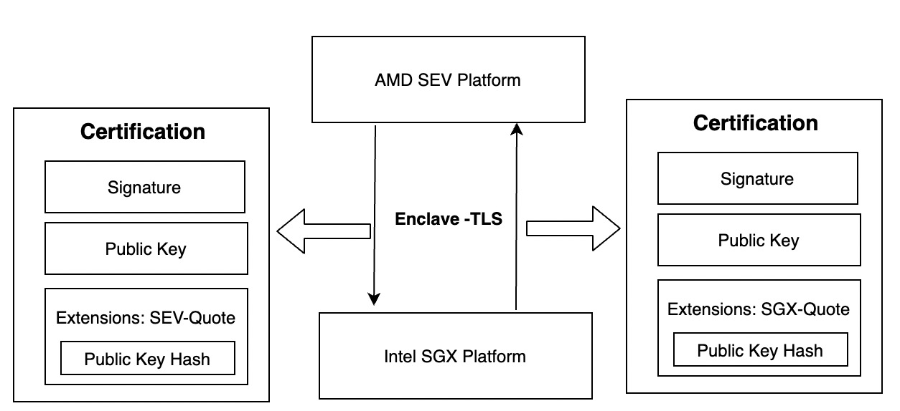
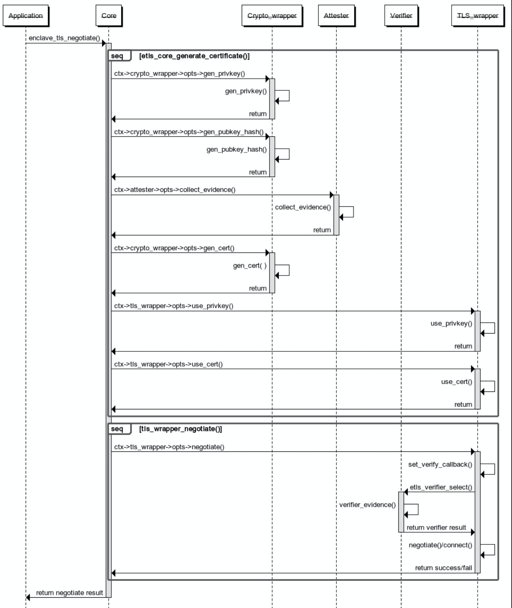

# 目录

- [介绍](#介绍)
- [架构设计](#架构设计)
  - [以硬件作为信任根，扩展数据安全边界](#以硬件作为信任根扩展数据安全边界)
  - [异构HW-TEE节点的安全可信通信](#异构hw-tee节点的安全可信通信)
  - [模块化设计，可扩展性强](#模块化设计可扩展性强)
- [工作流程](#工作流程)
  - [初始化阶段](#初始化阶段)
  - [运行阶段](#运行阶段)
- [实例设计](#实例设计)
  - [TLS Wrapper 实例](#tls-wrapper-实例)
  - [Enclave Attester 实例](#enclave-attester-实例)
  - [Enclave Verifier 实例](#enclave-verifier-实例)
  - [Crypto Wrapper 实例](#crypto-wrapper-实例)
- [应用场景](#应用场景)
  - [Enclave Attestation Architecture](#enclave-attestation-architecture-eaa)
- [参考文献](#参考文献)

---

[English Version/英文版本](design.md)

# 介绍

数据在整个生命周期有三种状态：At-Rest（静态）、In-Transit（传输中）和 In-Use（使用中）。在这个世界上，我们不断地存储、使用和共享各种敏感数据。保护处于所有状态中的敏感数据比以往任何时候都更为重要。如今被广泛使用的加密技术可以用来提供数据机密性（防止未经授权的访问）和数据完整性（防止或检测未经授权的修改），但目前这些技术主要被用于保护传输中和静止状态的数据，目前对数据的第三个状态“使用中”提供安全防护的技术仍旧属于新的前沿领域。

**机密计算指使用基于硬件的可信执行环境（Trusted Execution Environment，TEE）对使用中的数据提供保护**。 通过使用机密计算，我们现在能够针对“使用中”的数据提供保护。

总的来说，硬件可信执行环境（HardWare Trusted Execution Environment， HW-TEE）中运行的应用都是可信的，包括TLS库，因此似乎不用对HW-TEE内的TLS库进行特别的考虑，但与HW-TEE通信的对端必须要验证工作负载是否运行在真实的HW-TEE中。常规的远程证明工程化实践只是对远程证明底层原语进行了封装，实际产出就是让通信双方能够安全可信地协商出共享secret，并将如何基于共享secret创建安全通信信道的工作留给了应用开发者。

研究表明，RA和建立安全信道的逻辑必须要深度结合，否则易受中间人攻击的影响[1]。即使不将RA与TLS这么复杂的协议结合，至少也要能实现仅通过RA协议来协商出作为安全信道基础的共享密钥这一基本功能。但是仅做到共享秘密信息的程度是无法完全实现安全信道的。虽然基于共享秘密的方式能够实现安全信道，但是基于RA协议实现的安全信道的通信效率太低。针对这个问题，解决方法是将RA与能够提供安全信道的标准协议相结合，比如TLS协议。

Thomas Knauth 提出将Intel SGX远程证明和TLS结合的方案[2]，但是该方案面临着以下挑战：
- 如何灵活地支持不同的TLS库？
- 如何适配不同的HW-TEE环境？
- 如何让两个不同类型的HW-TEE互相验证对方的Evidence？

为了解决以上挑战，我们提出了Enclave-TLS，一种支持异构硬件可执行环境的双向传输层安全性协议。Enclave-TLS在TLS的基础上增加了将TLS证书中的公钥与HW-TEE attestation quote绑定的能力，基于HW-TEE硬件为信任根，即可证明了对方是在可信平台上，又可以高效的传输数据。同时Enclave-TLS还具有以下优势：
- 能够支持不同的HW-TEE类型。
- 能够支持不同的TLS库。
- 能够支持不同的密码学算法库。
- 能够支持不同类型HW-TEE间的双向TLS认证。

# 架构设计


Enclave-TLS的架构如上图所示，Enclave TLS 提供了五个API给上层的应用和服务使用，五个API能够实现可信安全信道的建立和数据的传输。Enclave TLS API的实现依赖于核心层与四类实例的实现。

为了提供更好的安全性，核心层与四类实例插件都运行在HW TEE环境中。由于Enclave-TLS架构需要支持和灵活选择多种可能性（例如：TLS库，加密库，Enclave形态等），因此根据功能逻辑区分出不同的实例插件是必不可少的。下面简单介绍一下核心层和实例插件的作用。
- **核心层**: 负责整体的控制作用，控制数据流的流向。
- **TLS Wrapper实例**: 负责完成真正的TLS session管理和网络传输。
- **Attester 实例**: 从本地平台运行环境中收集证明材料，通常要有Enclave配合生成quote数据。
- **Verifier 实例**: 负责验证收到的各种格式的quote数据，可能收到来自另一个不同的机密计算硬件平台发来的quote。也可能存在verifier与attester必须是相同平台的情况，比如verifier使用SGX ECDSA QVE的情况：强制要求当前运行环境必须支持SGX ECDSA，否则无法启动QVE来验证SGX ECDSA quote。
- **Crypto实例**: 负责配合其他实例完成与密码学算法有关的操作。例如，它可以生成自签名证书并将quote封装到证书扩展中。

Enclave-TLS的设计主要有以下优势：
- 将RA与能够提供安全信道的标准协议相结合，以硬件作为信任根，扩展数据安全边界。
- 支持异构HW-TEE节点的安全可信通信，不局限于平台。
- 模块化设计，可扩展性强。

## 以硬件作为信任根，扩展数据安全边界


现代的PKI为例，信任根是由 Aliyun、Google 和 Microsoft 等少数实体维护的根证书颁发机构列表，我们希望使用Hardware TEE作硬件为信任根（例如：Intel SGX，AMD SEV等），扩展数据安全的边界。为此，证明者需要在创建TLS连接阶段向验证者提供必要的证明材料，使得挑战者验证证明者是否正在可信的TEE（例如，Intel SGX）中运行。

为了实现将远程证明集成到 TLS 握手中的目标，我们必须解决两个目标：
- 需要将服务器的 Enclave-TLS 密钥绑定到 enclave 实例。
- 服务器/证明者必须在 TLS 连接设置期间提供必要的证明证据，以说服客户端/挑战者它确实运行在真实的TEE平台中。

具体做法如上图所示，我们以客户端连接服务端然后验证服务器的身份为场景。其中服务器是证明者，客户端是挑战者。具体流程如下：

1. 服务端生成密钥对，并将公钥和enclave实例绑定。

服务端启动之后，会创建一个enclave，在enclave中生成一个受保护的新的密钥对。Enclave-TLS将该公钥的hash值作为用户数据包含到Attestation报告中来绑定Enclave-TLS密钥和Enclave。该报告由证明者生成，并确保该报告确实是在真实的TEE平台上生成的。至此，Enclave-TLS公钥与enclave实例绑定。

2. 服务端生成带有证明材料的x.509证书。

我们引入了新的 X.509 扩展，每个扩展都有自己的唯一对象标识符 (OID)，从而将TEE平台的证明材料作为自定义 X.509 扩展嵌入服务器的证书中。 将证明材料添加到证书中比引入新的 TLS 扩展的侵入性要小，例如，引入新的 TLS 扩展需要对每个 TLS 实现进行修改。 通过扩展证书，我们不需要对现有 TLS 库进行任何更改，并且使用现成的hook机制来验证新的X.509 扩展。

传统上扩展证书需要由 CA 对其进行签名。 但是，由于我们建议使用硬件TEE 作为信任根，我们可以简单地对证书进行自签名。 我们不依靠 CA 将域名绑定到服务器的身份/密钥，而是依靠硬件平台来提供身份。

嵌入到 Enclave-TLS 证书中的证明材料根据Attester 实例的不同有所不同。具体信息需要参考不同的enclave实例的远程报告信息。

3. 客户端验证证书

Enclave-TLS 证书的接收者必须验证Evidence来确定特定平台上Enclave的可信度。 具体步骤因认证方法而异。 在协议方面，验证发生在标准 TLS 握手期间。 如果任何验证步骤失败，端点将中止握手以终止 TLS 连接。除此之外，验证者必须确保Enclave-TLS证书的公钥的hash确实存在于enclave的报告中，然后验证者将从证书中获取到的enclave的身份信息和验证者已有的基准信息进行比较。

## 异构HW-TEE节点的安全可信通信

在某些情况下，客户端和服务端可以运行在不同的机密计算平台上，可能存在服务端获取了不同的quote类型的认证报告。如何有效的对多种类型的quote实例进行验证并建立安全信道是一个问题。

为了解决这个问题，Enclave-TLS将验证不同quote类型的逻辑抽象成对应Verifier实例，通过对象标识符（[Object Identifier](https://en.wikipedia.org/wiki/Object_identifier)，OID）来区分接收到的证书类型，进而选择不同的Verifier实例进行证书的验证（异构HW-TEE节点的安全可信通信正在实现中）。

假设存在AMD SEV和Intel TDX两个平台，这两个平台需要建立双向的TLS信道。如下图所示，两个平台之间的TLS握手的流程如下：

1. AMD SEV平台在HW-TEE中生成自签名的TLS证书和私钥，并保证TLS证书的公钥绑定了由HW-TEE生成的带有硬件签名的evidence，然后发送给Intel TDX平台进行验证。

2. Intel TDX在HW-TEE中生成自签名的TLS证书和私钥，并保证TLS证书的公钥绑定了由HW-TEE生成的带有硬件签名的evidence，然后发送给AMD SEV平台进行验证。

3. Intel TDX平台和AMD SEV平台分别接收到对端的TLS证书，首先使用TLS证书的公钥验证证书的完整性，然后根据证书中对象标识符 (OID)的类型判断出quote的类型，并选择对应的Verifier实例进行quote的验证，从而确保特定平台上enclave的可信度。

4. 验证通过之后，两个平台之间可以建立双向的TLS信道。



## 模块化设计，可扩展性强

由于SGX SDK编程语言的特殊性，目前我们将Enclave-TLS和所有的实例全部放在SGX Enclave中，生成一个由SGX签名的enclave image，不能够支持灵活的应用模块化的插件方式。但是对于机密计算的加密虚拟机（例如AMD SEV， Intel TDX）形态或者SGX LibOS形态，Enclave-TLS能够极大的发挥出模块化结构，可扩展性强的优势。

Enclave-TLS架构需要支持和灵活选择多种可能性（例如：TLS库，Enclave形态等），因此插件的使用是必不可少的。整个Enclave TLS架构采用插件注册和回调模型的设计风格，在初始化阶段将每一个具体的实例的上下文信息注册到核心层中。在运行的时候，假如用户没有选择对应的运行实例，那么系统将会选择优先级最高的实例进行可信信道建立和数据传输。具体流程可以参考下一小节（[工作流程](#工作流程)）。

通过RegistrationAPIs，可以实现灵活的“插件”机制，也容易扩展一个框架的功能，发展其生态。调用者不一定是Application；这个模型可以在组成一个含有Application的完整架构中的每个子系统里实施这种模型。使得开发者能够非常容易扩展新的实例类型。
- Enclave TLS架构对具体的TLS Wrapper实例、Attester实例、Verifier实例和Crypto实例是无感知的。
  - TLS Wrapper实例、Attester实例、Verfier实例和Crypto实例的源码都可以单独进行编译，且无需Enclave TLS架构配合修改。
  - TLS Wrapper实例、Crypto Wrapper实例、Attester实例和Verifier实例都在编译时依赖Enclave TLS核心库`libenclave_tls.so`；而`libenclave_tls.so`本身在编译时不依赖任何TLS Wrapper实例、Attester实例、Verifier实例和Crypto实例。
- 如果需要支持新的实例类型（例如，openssl wrapper实例），只需要实例开发者开发对应实例的功能即可，不需要关注其他实例类型的细节。
- 不同的TLS Wrapper实例、Attester实例、Verfier实例和Crypto实例可以相互组合，满足不同场景下的多样需求。

# 工作流程

Enclave-TLS的工作流程主要分为初始化与运行两个阶段。

## 初始化阶段

在SGX SDK模式下，由于SGX的编程约束，将所有的实例（ TLS Wrapper实例、Attester实例、Verfier实例和Crypto实例）都打包进了静态库`libenclave_tls.a`中，静态库中包含每个实例的回调函数地址。

在非SGX SDK模式下（例如SEV，TDX，SGX Libos等），动态链接了核心库`libenclave_tls.so`的Enclave TLS应用在启动时，会隐式调用`libenclave_tls.so`的构造函数。

```c
	/* Load all crypto wrapper instances */
	enclave_tls_err_t err = etls_crypto_wrapper_load_all();
	if (err != ENCLAVE_TLS_ERR_NONE)
		ETLS_FATAL("failed to load any crypto wrapper %#x\n", err);

	/* Load all enclave attester instances */
	err = etls_enclave_attester_load_all();
	if (err != ENCLAVE_TLS_ERR_NONE)
		ETLS_FATAL("failed to load any enclave attester %#x\n", err);

	/* Load all enclave verifier instances */
	err = etls_enclave_verifier_load_all();
	if (err != ENCLAVE_TLS_ERR_NONE)
		ETLS_FATAL("failed to load any enclave verifier %#x\n", err);

	/* Load all tls wrapper instances */
	err = etls_tls_wrapper_load_all();
	if (err != ENCLAVE_TLS_ERR_NONE)
		ETLS_FATAL("failed to load any tls wrapper %#x\n", err);
```

核心库`libenclave_tls.so`的构造函数核心代码如上图所示，会以此加载`/opt/enclave-tls/lib`下的所有Crypto Wrapper 实例，Enclave Attester 实例 ，Enclave Verifier 实例和TLS Wrapper实例 。四类实例的加载过程逻辑一致，如下图所示：


以加载Crypto Wrapper 为例，具体流程如下：
- 调用`etls_crypto_wrapper_load_all()`尝试加载`/opt/enclave-tls/lib/crypto-wrappers`目录下的所有Crypto Wrapper实例。
- 通过dlopen加载每一个Crypto Wrapper 实例，并触发其构造函数的调用。
  - Crypto Wrapper实例的构造函数调用Crypto Wrapper API `crypto_wrapper_register()`。
- 调用每一个dlopen成功的Crypto Wrapper实例的`pre_init()`方法。
- 该Crypto Wrapper实例的上下文信息被注册到Crypto Wrapper子系统中`crypto_wrappers_opts`数组中。
- 根据优先级对`crypto_wrappers_opts`数组中所有的Crypto Wrapper实例进行排序。

# 运行阶段

客户端和服务端通过五个Enclave TLS API建立安全信道，然后进行数据的传输。

1. Enclave TLS应用调用Enclave TLS API `enclave_tls_init()`初始化Enclave TLS上下文。
如下图所示：Enclave TLS会依次选择参数指定的的Crypto Wrapper实例，Enclave Attester实例， Enclave Verifier实例，TLS Wrapper实例，然后调用对应的`init()`方法进行初始化。假如假如用户没有指定实例类型，会自动选择优先级高的实例作为运行实例。


2. Enclave TLS应用调用Enclave TLS API `enclave_tls_negotiate()`启动Enclave TLS协商。
- 对于开启了双向认证支持的客户端以及TLS服务端来说，需要调用`etls_core_generate_certificate()`创建Enclave TLS证书
  - 调用Crypto Wrapperr实例的`gen_privkey`和`gen_pubkey_hash`方法生成新的key pair和公钥的摘要值
  - 调用Enclave Attester实例的`collect_evidence`方法收集当前平台的证明材料
  - 调用Crypto Wrapper实例的`gen_cert`方法生成TLS证书
  - 调用TLS Wrapper实例的`use_privkey`和`use_cert`方法将私钥和证书加载到tls wrapper上下文
- 调用TLS Wrapper实例的`negotiate`方法
  - 设置验证TLS证书的验证回调函数。
  - 在进行TLS握手阶段，TLS库调用验证TLS证书的回调函数
    - 调用对应的Enclave Verifier实例的`verify_evidence`方法验证证书。
  - 如果是Enclave TLS客户端，连接远程Enclave TLS服务器；如果是Enclave TLS服务端，则监听TLS端口。



3. 当Enclave-TLS 可信信道建立成功之后，客户端和服务端直接就有可以通过Enclave TLS API `enclave_tls_transmit()`和`enclave_tls_receive()` 进行安全数据的传输。


4. Enclave TLS应用调用Enclave TLS API `enclave_tls_cleanup()`清理Enclave TLS运行环境。
如下图所示：Enclave TLS会依次调用Crypto Wrapper实例，Enclave Attester实例， Enclave Verifier实例，TLS Wrapper实例的`clean_up()`方法进行对应实例上下文的清除（例如：关闭句柄等），然后进行核心层的上下文环境清除。


# 实例设计

根据每一个实例各自的职责和约束条件，我们为每一类实例设计了通用的元数据和API。

## TLS Wrapper 实例

每一个TLS Wrapper实例设计了以下元数据和API来完成TLS session管理和网络传输的功能，以下是每一个元数据和方法的含义。

```c
typedef struct {
    uint8_t api_version;
	unsigned long flags;
	const char name[TLS_TYPE_NAME_SIZE];
	uint8_t priority; // The higher the value, the higher the priority.

	// Detect whether the current TLS library can run in the current environment
	tls_wrapper_err_t (*pre_init)(void);
	// Initialize the TLS library
	tls_wrapper_err_t (*init)(tls_wrapper_ctx_t *ctx);
	// Load the private key into the specific ssl context
	tls_wrapper_err_t (*use_privkey)(tls_wrapper_ctx_t *ctx, void *privkey_buf,
					 size_t privkey_len);
	// Load the certificate buffer into a specific SSL context
	tls_wrapper_err_t (*use_cert)(tls_wrapper_ctx_t *ctx, enclave_tls_cert_info_t *cert_info);
	// Establish the actual TLS connection
	tls_wrapper_err_t (*negotiate)(tls_wrapper_ctx_t *ctx, int fd);
	// Transmiting data
	tls_wrapper_err_t (*transmit)(tls_wrapper_ctx_t *ctx, void *buf, size_t *buf_size);
	// Receiving data
	tls_wrapper_err_t (*receive)(tls_wrapper_ctx_t *ctx, void *buf, size_t *buf_size);
	// Clean up TLS library
	tls_wrapper_err_t (*cleanup)(tls_wrapper_ctx_t *ctx);
} tls_wrapper_opts_t;
```

`libtls_wrapper_<type>.so` 会在初始化的时候，将元数据和方法注册到核心层。

```c
tls_wrapper_err_t tls_wrapper_register(const tls_wrapper_opts_t *opts);
```

## Enclave Attester 实例

每一个Attester实例设计了以下元数据和API来负责从本地平台运行环境中收集证明材料，以下是每一个元数据和方法的含义。

```c
typedef struct {
	uint8_t api_version;
	unsigned long flags;
	const char name[ENCLAVE_ATTESTER_TYPE_NAME_SIZE];
	/* Different attester instances may generate the same format of attester,
	 * e.g, sgx_ecdsa and sgx_ecdsa_qve both generate the format "sgx_ecdsa".
	 * By default, the value of type equals to name.
	 */
	char type[ENCLAVE_ATTESTER_TYPE_NAME_SIZE];
	uint8_t priority; // The higher the value, the higher the priority.

	// Detect whether the current attester instance can run in the current environment
	enclave_attester_err_t (*pre_init)(void);
	// Initialize the attester instance
	enclave_attester_err_t (*init)(enclave_attester_ctx_t *ctx, enclave_tls_cert_algo_t algo);
	// Collect extended certificate materials
	enclave_attester_err_t (*extend_cert)(enclave_attester_ctx_t *ctx,
					      const enclave_tls_cert_info_t *cert_info);
	// Collect evidence for generating Quote
	enclave_attester_err_t (*collect_evidence)(enclave_attester_ctx_t *ctx,
						   attestation_evidence_t *evidence,
						   enclave_tls_cert_algo_t algo, uint8_t *hash);
	// Clean up attester instance
	enclave_attester_err_t (*cleanup)(enclave_attester_ctx_t *ctx);
} enclave_attester_opts_t;
```

`libattester_<type>.so` 会在初始化的时候，将元数据和方法注册到核心层。

```c
enclave_attester_err_t enclave_attester_register(const enclave_attester_opts_t *opts);
```

## Enclave Verifier 实例

每一个Verifier实例设计了以下元数据和API来负责验证收到的各种格式的quote数据，以下是每一个元数据和方法的含义。

```c
typedef struct {
	uint8_t api_version;
	unsigned long flags;
	const char name[ENCLAVE_VERIFIER_TYPE_NAME_SIZE];
	/* Different attester instances may generate the same format of verifier,
	 * e.g, sgx_ecdsa and sgx_ecdsa_qve both generate the format "sgx_ecdsa".
	 * By default, the value of type equals to name.
	 */
	char type[ENCLAVE_VERIFIER_TYPE_NAME_SIZE];
	uint8_t priority; // The higher the value, the higher the priority

	// Detect whether the current verifier instance can run in the current environment
	enclave_verifier_err_t (*pre_init)(void);
	// Initialize the verifier 实例
	enclave_verifier_err_t (*init)(enclave_verifier_ctx_t *ctx, enclave_tls_cert_algo_t algo);
	// Verify the received quote evidenc
	enclave_verifier_err_t (*verify_evidence)(enclave_verifier_ctx_t *ctx,
						  attestation_evidence_t *evidence, uint8_t *hash,
						  uint32_t hash_len);
	// Collect collateral
	enclave_verifier_err_t (*collect_collateral)(enclave_verifier_ctx_t *ctx);
	// Clean up verifier instance
	enclave_verifier_err_t (*cleanup)(enclave_verifier_ctx_t *ctx);
} enclave_verifier_opts_t;
```

`libverifier_<type>.so` 会在初始化的时候，将元数据和方法注册到核心层。

```c
enclave_verifier_err_t enclave_verifier_register(const enclave_verifier_opts_t *opts);
```

## Crypto Wrapper 实例

每一个Crypto Wrapper实例设计以下元数据和API来配合其他实例完成与密码学算法有关的操作，以下是每一个元数据和方法的含义。

```c
typedef struct {
	uint8_t api_version;
	unsigned long flags;
	const char name[CRYPTO_TYPE_NAME_SIZE];
	uint8_t priority;  // The higher the value, the higher the priority

	// Detect whether the current crypto wrapper can run in the current environment
	crypto_wrapper_err_t (*pre_init)(void);
	// Initialize the crypto wrapper instance
	crypto_wrapper_err_t (*init)(crypto_wrapper_ctx_t *ctx);
	// Generate private key
	crypto_wrapper_err_t (*gen_privkey)(crypto_wrapper_ctx_t *ctx, enclave_tls_cert_algo_t algo,
					    uint8_t *privkey_buf, unsigned int *privkey_len);
	// Generate public key hash
	crypto_wrapper_err_t (*gen_pubkey_hash)(crypto_wrapper_ctx_t *ctx,
						enclave_tls_cert_algo_t algo, uint8_t *hash);
	// Generate certificate
	crypto_wrapper_err_t (*gen_cert)(crypto_wrapper_ctx_t *ctx,
					 enclave_tls_cert_info_t *cert_info);
	// Clean up crypto wrapper instance
	crypto_wrapper_err_t (*cleanup)(crypto_wrapper_ctx_t *ctx);
} crypto_wrapper_opts_t;
```

`libcrypto_wrapper_<type>.so` 会在初始化的时候，将元数据和方法注册到核心层。

```c
crypto_wrapper_err_t crypto_wrapper_register(const crypto_wrapper_opts_t *opts);
```

# 应用场景

## Enclave Attestation Architecture (EAA)

Enclave-TLS主要应用于Enclave 证明架构 (EAA)。EAA是针对云场景的通用且跨平台的远程证明架构，EAA的不同组件之间通信需要基于Enclave-TLS建立可信安全信道，以便租户能够明确知道他们的工作负载是否在真正的TEE环境中加载。请参考[文档](https://www.alibabacloud.com/help/zh/doc-detail/259685.htm)了解EAA的详细信息。

# 参考文献

[1] https://confidentialcomputing.io/wp-content/uploads/sites/85/2021/03/confidentialcomputing_outreach_whitepaper-8-5x11-1.pdf
[2] https://citeseerx.ist.psu.edu/viewdoc/download?doi=10.1.1.70.4562&rep=rep1&type=pdf
[3] https://arxiv.org/ftp/arxiv/papers/1801/1801.05863.pdf
