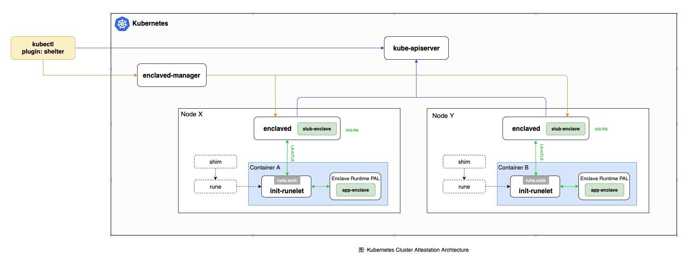

# Enclaved

## Introduction

Enclaved is a coordinator which creates a m-TLS(Mutal Transport Layer Security) connection between stub enclave and 
other enclaves with remote attestation (aka "[RA-TLS](https://raw.githubusercontent.com/cloud-security-research/sgx-ra-tls/master/whitepaper.pdf)").

Currently, we integrate two implementations for ra-tls based on [mutual-ra(rust-sgx-sdk, recommented)](https://github.com/apache/incubator-teaclave-sgx-sdk/tree/master/samplecode/mutual-ra) and [sgx-ra-tls(wolfssl)](https://github.com/cloud-security-research/sgx-ra-tls).

## Design



## Installation

TODO

## Build Source Code

### Requirements
* rust-lang

### Setup Environment

```bash
cargo install protobuf
cargo install bindgen

# Linux(Centos/RHEL)
yum install -y clang-libs  clang-devel

# MacOS
brew install clang

git clone https://github.com/alibaba/inclavare-containers.git
cd enclaved/

```

### enclaved(rust-sgx-sdk)

```
make
```

### enclaved(wolfssl)

```
export SPID=<YOUR_SPID>
export EPID_SUBSCRIPTION_KEY=<YOUR_SUBSCRIPTION_KEY>
export QUOTE_TYPE=SGX_UNLINKABLE_SIGNATURE 

make -f Makefile.wolfssl

```

## Run enclaved(rust-sgx-sdk)

Before:
* Save your SPID key into file `enclaved/bin/spid.txt`.
* Save your IAS API key into file `enclaved/bin/key.txt`.

```
cd enclaved/bin

# Run server
./enclaved --server (add --unlink if your spid's type is unlinkable)

# Run client
./enclaved --client (add --unlink if your spid's type is unlinkable)

```

# TroubleShootings

* Complie Error: `redefinition of 'struct tm'` 

Error Details:

```
./../ra-tls/wolfssl/wolfssl/wolfcrypt/wc_port.h:427:12: error: redefinition of 'struct tm'
  427 |     struct tm {
      |            ^~
In file included from stub-enclave.wolfssl/Enclave_t.h:13,
                 from stub-enclave.wolfssl/Enclave_t.c:1:
./rust-sgx/common/inc/time.h:76:8: note: originally defined here
   76 | struct tm {
      |        ^~
```

Conflict due to multiple definations between wolfssl and rust-sgx-sdk, we could just comment tm stuct defination in `ra-tls/wolfssl/wolfssl/wolfcrypt/wc_port.h`.


