Catch the replay of the Apsara Conference 2020 at [this link!](https://www.alibabacloud.com/apsara-conference-2020/live-streaming?spm=a2c65.11461447.0.0.2838353dECci4r)

By Qian Yue and Guo Chaohong.

The contents of this blog were taken from a larger virtual presentation from the 2020 Apsara Conference.

This speech is divided into two parts. Qian Yue (from Alibaba Cloud Intelligence) will be responsible for the first part, and Guo Chaohong (from Intel IAGS) will be responsible for the second part.

## Part 1 – The Inclavare Containers Project

To judge from the current development trend, confidential computing has great potential, but it is still in the early stages. In the technical heat curve of the computing infrastructure released by Gartner last year, confidential computing was mentioned for the first time and is at the innovation trigger stage. Therefore, confidential computing still has many shortcomings in the engineering field. On the one hand, it is difficult to develop system software with SDK that is commonly used in the engineering field. On the other hand, the solutions provided by CSPs are generally implemented based on a single bare metal architecture, which sets a high threshold for use.

Since most attempts to promote confidential computing at the IaaS layer produced negative results, we found another way: we are trying to introduce confidential computing technology to the container ecosystem. To put it into practice, we initiated the Inclavare Containers project.

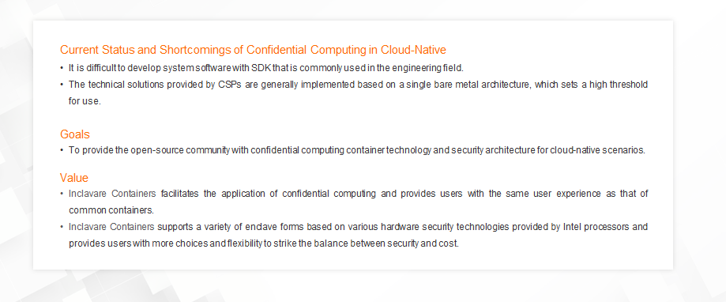

This project aims to provide the open-source community with the cloud-native-oriented confidential computing container technology and security architecture, giving full play to the characteristics of confidential computing. In terms of value, we wish to greatly reduce the cost of developing and using confidential computing by combining with container technology. This allows users to enjoy the high security brought by confidential computing and maintain the same user experience as common containers. Inclavare Containers will support a variety of enclave forms based on the hardware assistance of Intel processors to cover a wider range of user groups with different levels of security requirements. Inclavare Containers will provide users with more choices and flexibility to strike the balance between security and cost.

## The Open-Source Project of Inclavare Containers

First, this open-source project is innovative. It integrates cloud-native container technology with confidential computing technology. The rune component has been added to the reference list of OCI runtime. In addition, Intel has confirmed its participation in the development of the open-source community.

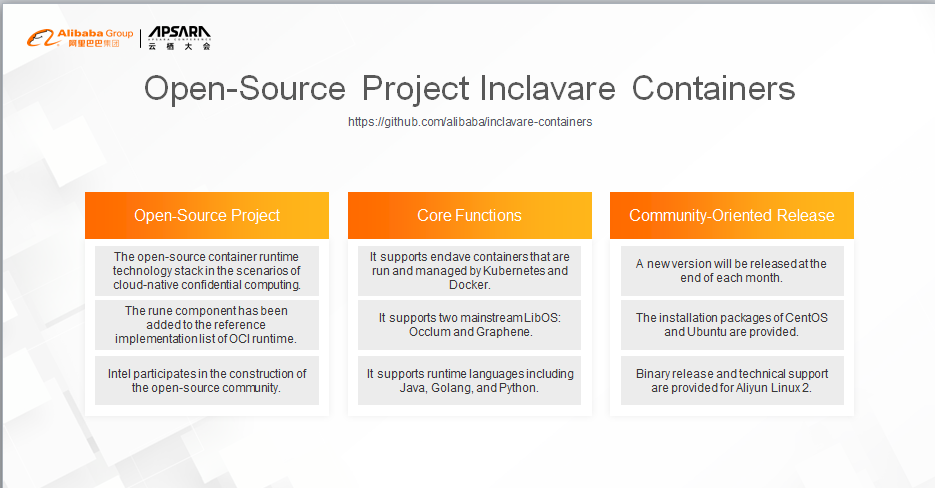

Currently, the project supports the following core functions: It allows enclave containers to be started through Kubernetes and Docker. Container applications can run [directly] in the protected TEE environment. In terms of LibOS support, Inclavare Containers support Occlum by default and provides support for Graphene. In terms of runtime language, Inclavare Containers supports "three" advanced languages.

We will release a minor version at the end of each month for the community. Currently, three versions have been released. Community users can use and deploy Inclavare Containers on the mainstream Linux distributions by using the installation packages. For the self-developed Aliyun Linux 2 distribution by the Alibaba Operating System Team, we also provide dedicated user guides and technical support to help users deploy Inclavare Containers on Alibaba Cloud.

## The Architecture of Inclavare Containers

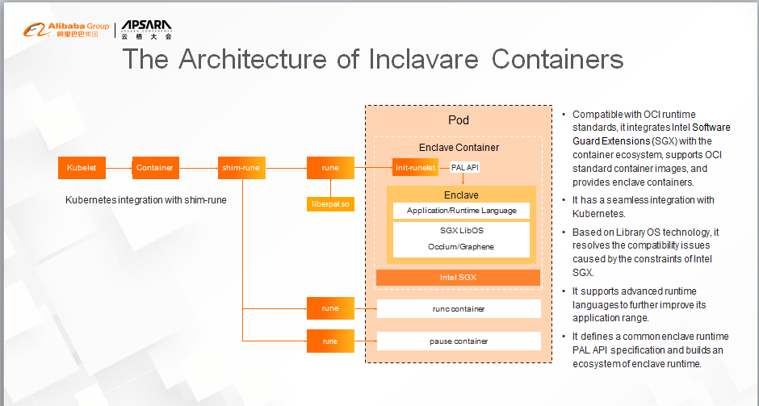

First, we integrate Intel SGX technology with the mature container ecosystem to deploy and run sensitive applications of users (in the form of enclave containers.) We want to free users from understanding the complexity brought by confidential computing when they create images, and to give them the same user experience as common containers.

Second, Intel SGX technology provides high-security protection, but it also brings some programming constraints. For example, the syscall command cannot be run in the SGX enclave. Therefore, we introduced LibOS technology to resolve the software compatibility issues and remove developers&lsquo; burden of performing complex software adaptation in the process of porting software to the Intel SGX enclave.

Last but not least, Inclavare Containers supports multiple runtime languages, including Java. In this way, the application range of enclave containers is enlarged and improved. In addition, powerful language ecosystems, like Java, are also introduced to confidential computing scenarios, enriching the variety and quantity of confidential computing applications.

Milestones of the Open-Source Inclavare Containers
The project was established at the end of last year. The PoC was completed in March, and the v0.1 version was released in mid-May. After a series of development processes, we witnessed the establishment of the project from scratch, led it to engineering practice from innovative inspiration, and determined its evolution direction after directional exploration.

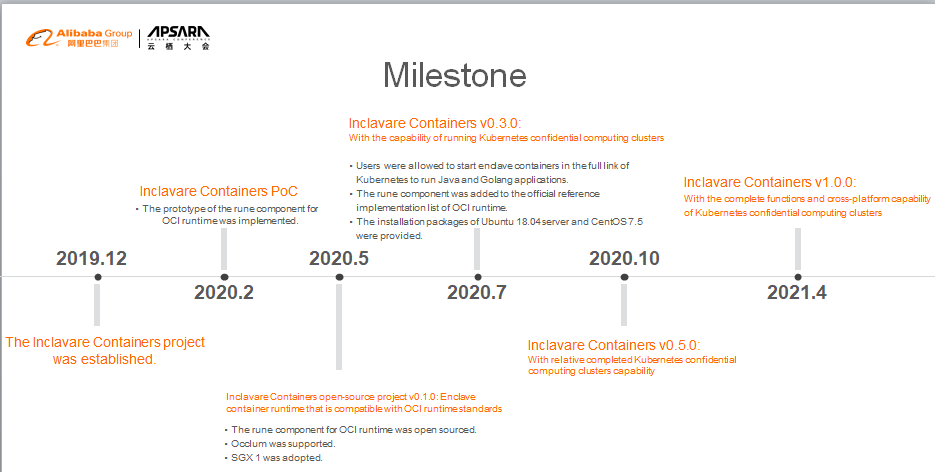

Currently, we have formed a systematic and phasic development strategy and determined the evolution direction. In the release of the v0.5 version, Inclavare Containers will provide a complete confidential computing cluster capability and support the implementation of Alibaba Cloud ACK-TEE 2.0 based on this capability. At the same time, we will also complete the pre-research and exploration and in new directions for Inclavare Containers 1.0.

To sum up, we want to continue to improve the confidential computing cluster product, ACK-TEE. It is more secure and easier to use based on the technical advantages of Alibaba Cloud container technology.

Relying on the Inclavare Containers technology and ecosystem, while supporting ACK-TEE products, we intend to provide open-source and standardized container technology.

From a strategic perspective, Alibaba Cloud is continuously committed to providing security protection that covers the entire lifecycle of data. Therefore, we are also making continuous progress towards the development of confidential computing technology and the continuous evolution of ACK-TEE products, making Alibaba Cloud a worthy cloud service provider in confidential computing technology.

## Part 2 – Intel SGX: Public Cloud Confidential Computing with Intel SGX
In terms of data security, there are mature solutions for storage and transmission security. Data usage security is getting more attention.

There are many privileged codes in multi-user computer systems, such as BIOS, operating system, and Virtual Machine Manager (VMM.) If a malicious program controls the system by exploiting the vulnerability of privileged code, the data security of other users using this system cannot be guaranteed.

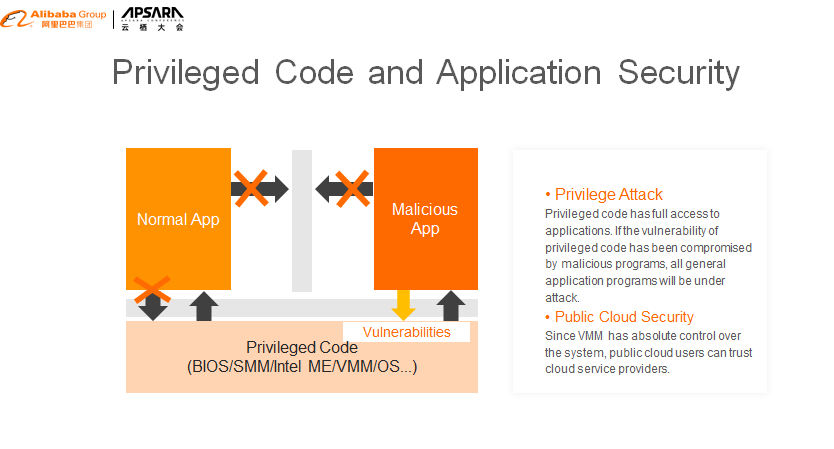

Especially in the multi-tenant public cloud environment, virtual machines of different tenants may run on the same physical server. Malicious programs can exploit the vulnerability of VMMs to gain system privileges and access other tenant&lsquo;s data. Besides, the VMM has absolute control over the system and can access users&lsquo; data. Therefore, some users do not trust the public cloud service provider and refuse to use the public cloud.

Intel&lsquo;s SGX technology resolves the issue of data security. Its basic idea is to divide the application into two parts: trusted memory and untrusted memory. SGX technology exclusively allocates private memory to store the trusted data for a specific process. The data in the private memory cannot be accessed even by running privileged code. In the Intel documentation, this private memory is called "enclave."

The enclave acts like a black box. The code that runs inside provides some functions for external systems to call, but the code that runs outside cannot read the data in the enclave. Unless the enclave exits because of asynchronous events, such as hardware shutdown, programs must follow the request-response pattern and use SGX instructions to transfer data in and out of the enclave.

Since privileged code cannot be used to access the data in the enclave, even attackers that use privileged code to gain system management permissions cannot access the trusted data of other users.

SGX technology effectively resolves the trust issue between tenants and providers on the public cloud. For example, some users want to use Alibaba Cloud but worry that Alibaba Cloud may monitor their data. With SGX, this issue no longer exists.

This slide shows the four intentions that SGX has implemented.

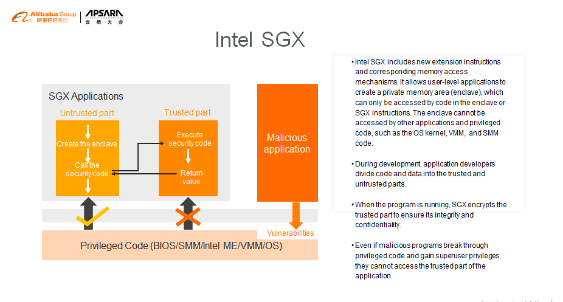

The BIOS reserves a segment of physical memory for SGX and reports the memory to VMM or OS through the E820 table. Neither privileged code nor DMA can be used to access this memory.

OS or VMM uses the reserved physical memory to create the memory dedicated to a specific process, namely, the enclave.

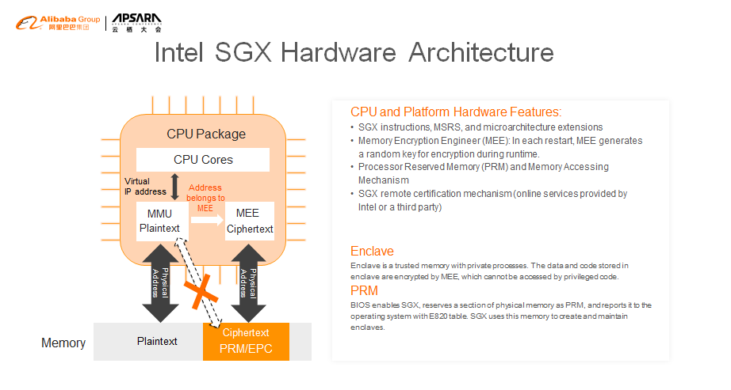

By adding or removing a Memory Encryption Engine (MEE) from the memory controller, we can encrypt and decrypt the data that enters and exits the enclave. The key used by MEE encryption is randomly generated each time the machine is started or restarted.

When the memory controller receives the virtual address accessed by the CPU, if the corresponding physical memory belongs to SGX, the matter is transferred to MEE for processing. Access to non-SGX memory is still handled by MMU. Page table translation in the memory is still done in the untrusted part, so the traditional non-SGX code (OS or VMM) does not require any changes.

Through EENTER and ERESUME, the untrusted part calls the code in the enclave, which returns a response to the caller through EEXIT.

Like the management of normal memory, the management of the enclave memory also includes virtual addresses and physical memory. When you create an enclave, a data structure (SECS) is used to describe the enclave, which has two domains that specify the virtual address range of the enclave. Page table mapping is managed by an SGX driver and physical memory is allocated when a fault occurs in the page table mapping.

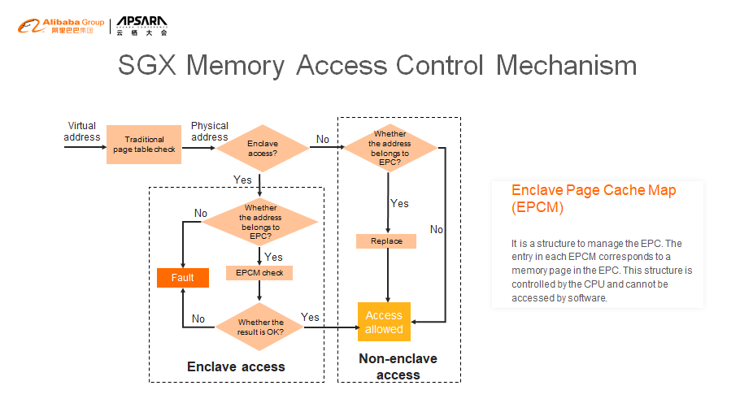

This is a flowchart of SGX memory access control.

- **Enclave Access:** Code in the enclave is executed. When the enclave accesses memory outside the enclave, a #GP exception is generated.
- **Non-Enclave Access:** Code outside the enclave is executed. When code outside the enclave accesses the enclave memory, an abort page is generated.

## How Does a Public Cloud Tenant Know That Their Programs Are Running on SGX?

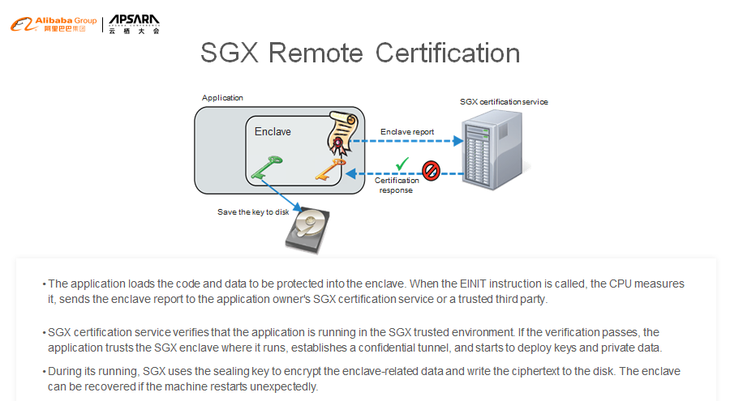

To prove this, SGX provides a remote certification mechanism. The certification service provider can be the tenant&lsquo;s local server or a trusted third party. Intel has published many papers and provided the fully open-source implementation code. Here is a simple schematic diagram. I will not elaborate on the details, but anyone interested in this can check Intel&lsquo;s website for more information.

The tenant program running on the cloud uses EINIT to create an enclave. The CPU generates a digest for the content in the enclave based on the key and sends the digest to the remote certification service provider.

The remote certification service provider verifies that the application runs in the SGX trusted environment based on the digest. Then, the application establishes a secret channel and starts to deploy keys and private data.

During its running, SGX uses the sealing key to encrypt the enclave-related data and write the ciphertext to the disk. The enclave can be recovered if the machine restarts unexpectedly.

## SGX Software Stack
Both Linux and Microsoft Windows support SGX. Application developers can use the SGX SDK provided by Intel to develop SGX-based applications and ensure data security during use.

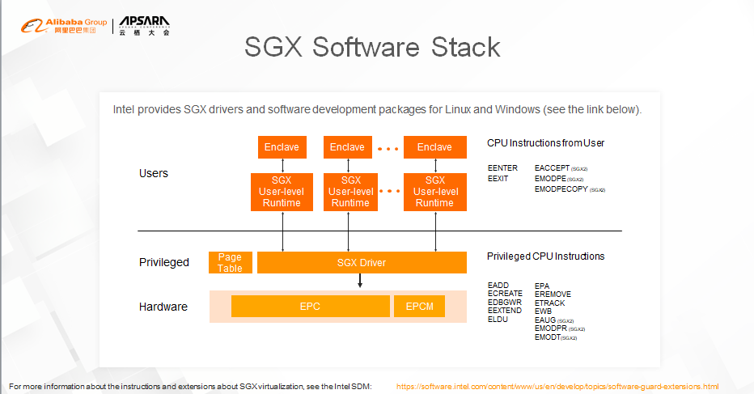

Anyone interested in this can visit this website.

## Application Scenarios of SGX

With the development of technologies such as public cloud, edge computing, and blockchain, data security has attracted increasing attention. Many users who want to use remote hardware resources are worried about data leakage and do not trust remote hardware owners and public cloud service providers. SGX technology can resolve this trust issue and provide a solid hardware foundation for confidential computing. There are many scenarios where SGX can be used. Here are some examples.

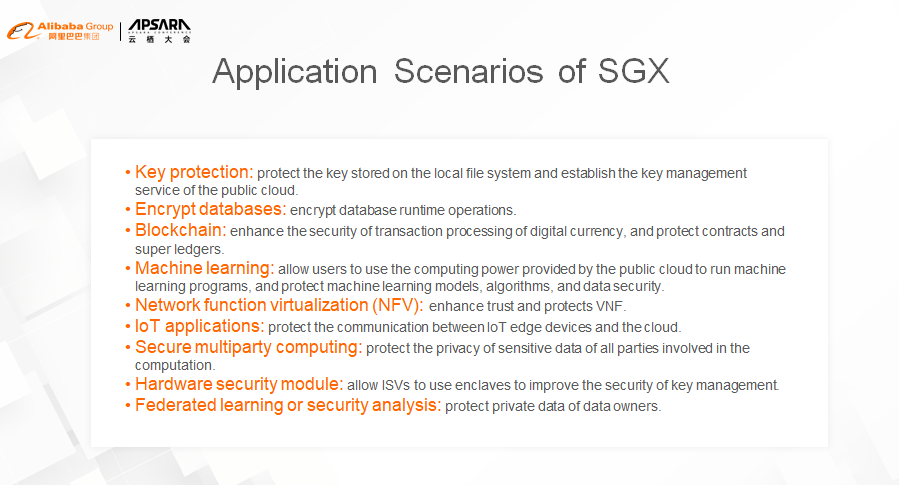

To further promote confidential computing, eliminate users&lsquo; worries about data leakage, and encourage them to use the public cloud with confidence, Intel is currently cooperating with Alibaba to develop the infrastructure of confidential computing and provide users with confidential computing services on Alibaba Cloud.

## About the Authors

Qian Yue is from Alibaba Cloud Intelligence and is the Director of Alibaba&lsquo;s Operating System Security Innovation Team. Qian Yue mainly take charges of the work on confidential computing and trusted computing. Qian Yue is also the initiator of the open-source project, Inclavare Containers.

Guo Chaohong works for Intel IAGS and has worked closely with Intel SGX.

This document is from [Inclavare: Confidential Computing Container Technology for Cloud-Native.](https://www.alibabacloud.com/blog/inclavare-confidential-computing-container-technology-for-cloud-native_596708)
