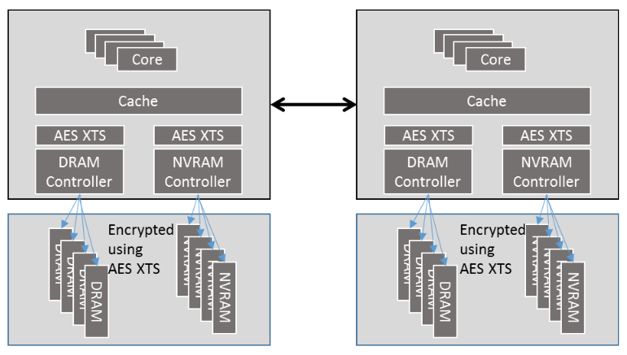
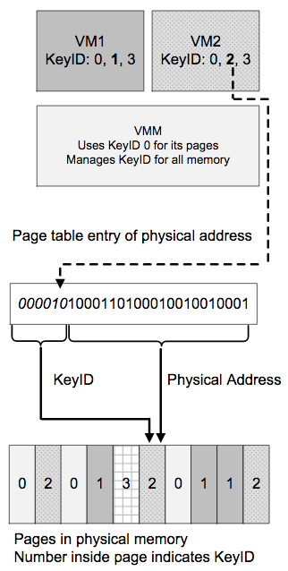
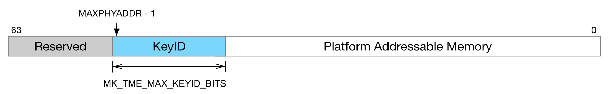

# 市场需求

人们对透明全内存加密这个功能的需求主要来自对机密和敏感数据的保护。普通RAM里面储存的数据，在掉电之后，一般都以为是彻底消失了。但其实在一些复杂的离线攻击下，这些数据仍然是能被恢复出来并导致泄密；而持久性存储器（即外存，包括磁盘、SSD、eMMC等）的数据更加容易泄露。这些设备可能有硬件锁机制的保护，但是用户其实希望的是更细粒度的保护，比如per进程/容器/VM级的。

Intel制定了Intel架构下的内存加密技术规范，即TME架构，以及构建在这个架构之上的、能满足更细粒度内存加密需求的MKTME。

------

# TME架构

TME是Total Memory Encryption的缩写。**该架构定义并实现了透明全内存加密特性的最基本功能：使用由处理器内的RNG生成的单一的临时密钥对全部物理内存（包括NVRAM）以透明地方式进行加密。** 所谓“临时”指的是每次处理器启动时都会通过RNG重新生成一把密钥，这把密钥被称为**平台密钥**。一旦开启TME特性，TME exclusion区域以外的全部内存区域全都使用平台密钥进行加解密。

为了防止平台密钥的泄露，软件或处理器接口都无法访问到这把平台密钥。

下图是TME架构在一个具有双NUMA节点系统中的参考实现图：

在系统启动的早期阶段，BIOS就会开启该TME。**一旦开启了该特性，在外部内存总线上和DIMM中观测到的一律都是加密后的数据。** 能够达到这种效果的原因是处在cache与DRAM/NVRAM控制器之间的AES-XTS加解密引擎对所有进出cache的数据一律要进行解密和加密处理。由于cache、寄存器以及更偏向处理器核一侧的其他微架构层组件仍旧使用明文数据，因此TME架构对已有的软件和I/O模型来说是完全透明的。

总体而言，TME架构具有以下特点：

- 架构和功能简单直接：使用单一的平台密钥对内存进行加密
- 一些更复杂的安全特性（比如SGX2和TDX）可以轻易地叠加在这个基础架构之上
- **对软件几乎完全透明，兼容性好**
- **对性能的影响与工作负载强相关**

TME的最大缺点是只能使用一把平台密钥来加密内存，不支持在系统里划分出多个基于加密密钥构建的加密内存domain；但MKTME就支持使用多把密钥，进而实现per进程/容器/VM粒度的加密内存domain。

------

# MKTME

MKTME是Multi-Key Total Memory Encryption的缩写。它在TME架构的基础上，实现了以页为粒度、支持使用多把密钥对内存进行加密的功能，同时还允许由软件设置AES-XTS加解密引擎所使用的密钥。

下图是将MKTME用在虚拟化场景中的一个示例图：

在这个示例中：

- Hypervisor使用KeyID 0 (即TME定义的平台密钥)来访问所有的加密内存
- VM1和VM2都可以使用KeyID 0来访问自己的加密内存
- VM1使用KeyID 1来访问自己的私有加密内存
- VM2使用KeyID 2来访问自己的私有加密内存
- VM1和VM2可以使用KeyID 3来访问两个VM共享的加密内存

KeyID字段被包含在PTE中，且位于物理地址字段的高位，就像是物理地址字段的一部分（即通过减少一部分物理地址宽度来实现），同时被用在处理器内部的微架构层中（除了AES-XTS引擎），这个特性叫做**物理地址位超卖**（oversubscribing）。该特性使物理地址具有了别名，即具有相同物理地址的页可以有不同的KeyID。

KeyID信息是不会出现在处理器外部的（比如内存总线上）。物理地址位超卖不会影响cache和TLB的行为，因为KeyID仅被当做成物理地址的一部分来处理；但物理地址位超卖会影响大多数的页表类型：Host普通IA页表、EPT和IOMMU页表。

- IA paging
  MKTME会影响Host侧的IA paging（含每一级页表），即在物理地址字段的高位中包含KeyID字段；CR3寄存器也受此影响，也包含了KeyID。

  **MKTME不会影响Guest中的IA paging，因为Guest中的IA paging用于产生GPA，而不是最终的HPA，所以设计设计上没必要在Guest的IA paging中设置KeyID字段**，即GPA中不包含KeyID，因此也无法为VM的应用再提供更细粒度的密码学隔离（即per VM应用级的KeyID）。

- EPT paging
  MKTME会影响EPT paging（含每一级页表），因为EPT用于将GPA映射到HPA，而HPA必须要包含KeyID。

- 其他物理地址
  其他的物理地址结构（如VMCS指针、物理地址位图等）也都需要包含KeyID。

虽然前面的例子中Hypervisor使用的是KeyID 0，但Hypervisor具有特权，可以使用任意KeyID访问自己的加密内存，也能管理和设置每个VM所能使用的KeyID。

MKTME支持的密钥数量总是固定的，而具体数量由特定的处理器实现来决定。软件可以通过配置只使用其中的部分密钥，这组密钥被称为可用密钥。软件负责管理可用密钥，并可以使用可用密钥对任意一个内存页进行加密。

在软件不进行任何显式配置的情况下，MKTME引擎默认使用TME的平台密钥进行内存加密。**MKTME也允许使用软件提供的密钥或处理器RNG生成的密钥。** 在虚拟化场景中，VMM或Hypervisor负责管理每个VM所使用的密钥，并透明地对Guest OS实施加密保护（在这个场景中，可以将MKTME视为TME虚拟化技术）。

总而言之，MKTME希望在系统层面能够创建**多个独立的加密内存domain。** 这对用户来说也更加安全。

------

# 安全威胁模型分析

**TME和MKTME的安全性依赖于特权软件（OS和VMM/Hypervisor），这点与传统虚拟化技术的安全边界完全一致。** 假设在攻击者拥有特权的情况下，攻击者能将所有物理页的加密模式都改为非加密模式。事实上只要攻击者拥有特权，就已经能够访问任意内存了，只不过需要使用正确的KeyID来访问per进程/容器/VM实例的加密内存，比如在访问VM实例内的数据前需要在EPT PTE中找出正确的KeyID，然后建立一个使用该KeyID的PTE映射来访问该物理页。

此外，TME和MKTME没有对数据提供完整性保护，因此软件使用错误的KeyID访问加密内存、或直接篡改加密内存中的内容都是可行的（比如纯粹的破坏数据的行为，或是用已知明文的密文来覆盖以实施重放攻击）。

由于软件和处理器接口无法访问到TME平台密钥以及MKTME中由处理器硬件自生成的密钥，因此密钥本身是存储安全的；但由软件提供的MKTME密钥可能会因调用者考虑不周而遭到泄露，这个难题需要软件设计者自己来解决。

由于cache中的数据是明文的，因此TME和MKTME无法抵御像L1TF这种利用处理器speculative execution侧信道漏洞的攻击方式来间接probe cache中的明文数据的这种攻击方式。

综上所述，**由于特权软件仍有足够的权限来降低TME和MKTME的安全性，因此TME/MKTME技术目前还不属于机密计算的范畴，即无法做到哪怕在被攻破的OS/VMM环境里也能够保护租户机密数据的强度。** TME和MKTME防范的攻击路径是从恶意VM实例到Hypervisor。更具体来说，只要攻击者无法跨域安全域（指从guest ring0到host ring0）且在软件采用了正确配置的情况下，TME和MKTME就能够在一定程度上抵御恶意VM实例对Host或其他VM实例的数据泄露攻击；但前提是租户必须信任CSP（即Hypervisor和host所能提供的安全性能够抵御攻击者的入侵，同时CSP自身不会作恶）和Intel CPU。

目前Intel MKTME也在继续进行迭代，相信很快就能看到能与AMD SEV中防止特权软件修改VM实例内存加密模式的保护机制了。

------

# Linux支持情况

在Icelake这一代不会在Linux kernel upstream中提供对MKTME的单独支持了，需要等到Intel下一代处理器；但Icelake不单独支持不意味着这个技术没用。Icelake支持SGX2，而SGX2的MEE相较于SGX1就改用MKTME提供内存加密的能力，只不过这个MKTME对系统软件不可见。

目前Linux upstream对MKTME的支持仅仅提供了最最基本的CPU枚举和PCONFIG的实现，之前提的一些patch也没有合入upstream。

------

# 参考

- [TME介绍](https://en.wikichip.org/wiki/x86/tme)
- [Intel Architecture Memory Encryption Technologies Specification](https://software.intel.com/sites/default/files/managed/a5/16/Multi-Key-Total-Memory-Encryption-Spec.pdf)
- [LWN: memory加密方案讨论](https://www.codercto.com/a/76108.html)
- [Runtime VM Protection By Intel MKTME](https://schd.ws/hosted_files/lc32018/38/mktme_lc3_2018.pdf)
