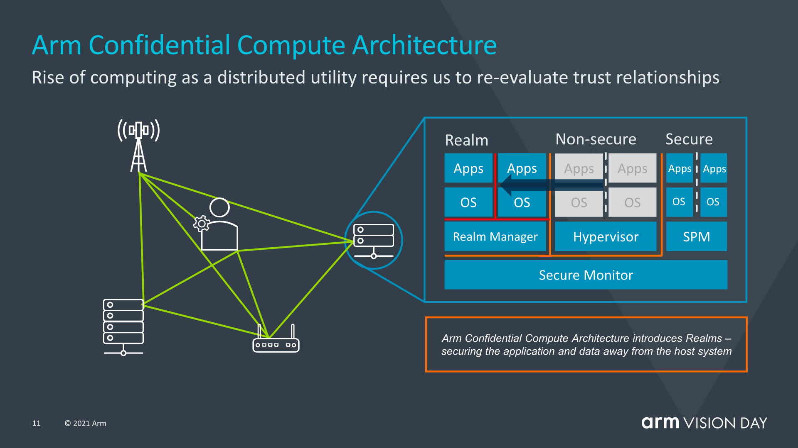
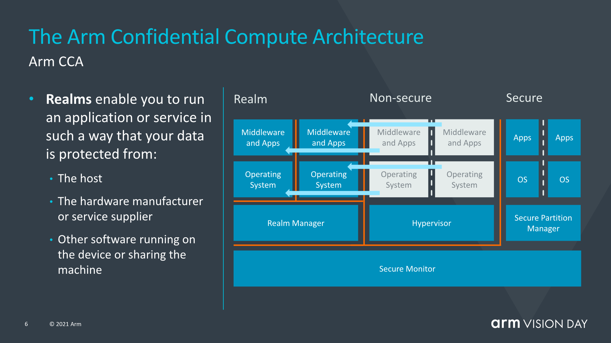
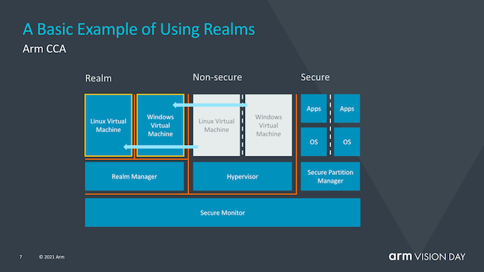
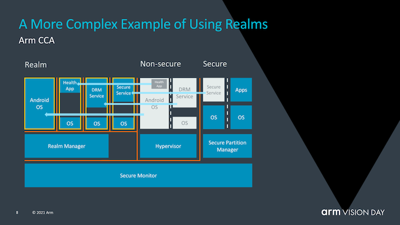

RMv9的新闻刷屏了。ARMv9号称十年以来最大重大变革，因此让我们看下ARMv9中机密计算相关的新特性Realm。

注：本文是对[Introducing the Confidential Compute Architecture](https://www.anandtech.com/show/16584/arm-announces-armv9-architecture/2)的部分翻译和个人注解。

# 背景

在过去的几年里，我们看到安全问题和硬件安全漏洞已经成为了新闻热点。许多处理器侧信道漏洞，如幽灵、熔毁以及与它们有关的侧通道攻击，都表明有必要重新思考如何在处理器架构层面解决安全问题。

Arm想要解决这个问题的方法是：通过引入Arm机密计算体系结构（Arm CCA），重新设计敏感应用程序的工作方式。

---

# 一句话亮点总结

Arm CCA基于Armv9 Realm Mangement Extension（RME，简称Realm），将敏感应用和OS隔离在Realm中；Realm比机密虚拟机更加通用，既支持机密虚拟机形态，也支持机密OS形态。

---

# Hign Level设计

Arm CCA基于Armv9 Realm Mangement Extension，将敏感应用和OS隔离在Realm中：
 

从这张图可以总结出以下几个要点：

- Non-Secure World、Secure World和Realm之间是相互隔离的。

  - 现有材料中没有详细解释这种隔离是如何实现的，大概率还是基于硬件的地址空间隔离技术。
  - 对Realm的隔离要看两个方面：运行在Realm中的敏感应用也可能是租户部署的恶意应用，因此对Realm的隔离也是必要的，即双向隔离。

- Realm可以运行OS（简称Realm OS），也就是说Realm提供了高特权级的支持，可以运行EL1特权软件。
  - Realm OS的形态可以有多种：
    + 不一定非要是经过裁剪和安全加固过的Linux内核，也可以为Realm设计的TEE OS，或者由支持其他机密计算的OS技术实现演进过来额外支持Realm的LibOS（如Enarx、Occlum、Graphene等）；但这种TEE OS不能是支持TrustZone的TEE OS，后面会讨论这个话题。
    + TEE OS目前的一种发展趋势是缩小TCB、减少Rich OS潜在的攻击面进而提升整体的安全性；但在是否需要提供良好的业务逻辑兼容性上存在分歧：
      - 一种方案是不考虑对业务的兼容性，以安全为先，可以适度牺牲性能和兼容性。
      - 另一种方案还是重视对存量业务的兼容性，以兼容性为先，可以适度牺牲性能和安全性。
      - PS：Unikernel又有机会了！

- EL2运行Realm Manager，负责管理Realm的调度和资源分配；可以预见这部分会由Arm CCA firmware架构来支持（类似ATF，或直接在ATF中进行扩展来支持）。
  - 从目前的资料来看：Realm Manager是Arm新写的，其代码量大概是Hypervisor大小的十分之一。
  - Realm Manager和TDX中的SEAM Module很像：在处理器架构级为该功能模块提供了一个新的运行模式；同时该功能模块承担了Realm生命周期和资源管理的功能，系统中其他不可信的组件不能替代其功能和角色。

- TrustZone对Realm也是不可信的；也就是说Realm不是像TrustZone那样只解决计算资源隔离的问题，而是解决更进一步的敏感数据隔离的问题。

---

# 安全威胁模型

这张图说明了Realm的安全威胁模型，可以看出它具备典型的机密计算技术的特点：

从这张图可以总结出以下几个要点：

- 这里的hardware manufacture指的是外设的硬件设备提供商，而不是处理器本身的硬件提供商（比如Arm或SoC厂商）。

- Realm Manager不属于Realm的一部分，但它是用户TCB的一部分。

---

# 用法

由于Realm具备运行完整OS的能力，所以看上去可类比TDX的trust domain以及SEV/CSV的机密虚拟机，但下面的用法中则揭示了Realm相比机密虚拟机形态更为通用的一面：

从这张图可以总结出以下几个要点：

- 由于TrustZone中的TEE OS不是通用OS，而是结合TrustZone深度定制过的，因此无法将TEE OS直接加载到Realm中并运行，这也打破了原先认为Realm会基于TrustZone架构进行迭代的假设；但适配了OP-TEE的TA是可以运行在Realm中的，只要Realm OS能够支持OP-TEE的TA API。换句话说，这张图可能也暗示了Arm接下来会在Realm OS中提供对TA的支持，当然也可能这张图只是展示Realm的兼容性能力；此外，在Realm中运行Android应用也存在上述的可能性。

- Realm Manager本质上充当了类似Hypervisor管理VM的角色，只不过Realm Manager管理的对象是Realm。
  * 当Realm运行VM的时候，可以认为把Hypervisor中涉及到Realm安全性的逻辑挪到了Realm Manager中，而把不涉及其安全性的部分保留在传统Hypervisor中。

- Realm仅仅是专门为运行敏感应用而提供的硬件TEE，它的使用者可以将自己环境内的工作负载通过Realm Manager将敏感应用+OS一起加载到Realm中，甚至是将一个完整的虚拟机加载到Realm中，因此ealm不是机密虚拟机，而是泛用性更高的通用型机密计算运行环境底座。

综上所述，Realm技术不仅大幅度降低了敏感应用对信任的需求以及用户在适配Realm的成本，而且OS自身的安全性问题对Realm应用来说将变得非常透明（但Realm应用对外提供的服务以及Realm OS对外暴露的接口的安全性依旧需要重视）。此外，因为关键性应用能够安全地在任何支持CCA的系统中运行，而当今公司或企业往往需要使用具有各种安全合规的授权软件栈的专用设备才能实现这种安全性，因此这种技术也能降低用户在安全上所投入的成本。

---

# Slide中没有直接体现出来的要点

- Realm中的应用能够attest Realm Manager以确保它是可信的。

- 内存加密。这个是机密计算的必备能力。

- 目前的资料没有显示出Realm提供的这种通用运行能力是如何支持Realm与IO设备间的交互的。据说Confidential IO问题还没有在Realm 1.0中得到解决，也许会在下一代技术中解决。

---

# 后续

目前Arm仅仅提供了关于CCA如何运作的high level解释，有关该机制究竟如何运作的更多细节将在今年夏天晚些时候公布。
