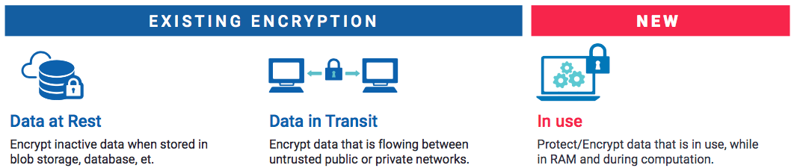

注：本文是对[机密计算联盟](https://confidentialcomputing.io/)发布的白皮书[Confidential Computing: Hardware-Based Trusted Execution for Applications and Data v1.2](https://confidentialcomputing.io/wp-content/uploads/sites/85/2021/03/confidentialcomputing_outreach_whitepaper-8-5x11-1.pdf)的原文翻译。

# 介绍

在今天常见的数据保护方式中，通常只在存储和网络传输的过程中对数据进行了加密保护，但在内存中使用数据时则不对其进行加密保护。此外，在传统的计算基础设施中对使用中的数据和代码进行保护存在诸多能力上的限制。与此同时，相关组织需要对处理个人识别信息（PII）、财务数据或健康信息等敏感数据的应用和内存中的敏感数据提供机密性和完整性保护，以免受针对它们的安全威胁。

**机密计算通过在基于硬件的可信执行环境（TEE）中执行计算的方式来保护使用中的数据。** 这些安全的、隔离的环境可防止对使用中的应用程序和数据进行未经授权的访问或篡改，从而提升相关组织在管理敏感数据和受监管数据方面的安全级别。

---

# 为什么需要机密计算？

## 数据的状态

在计算的过程中，数据存在三种状态：传输中、静止和使用中。数据于网络中传输属于“传输中”状态，存储的数据属于“静止”状态，正在处理的数据属于“使用中”状态。在这个世界上，我们不断地存储、使用和共享各种敏感数据：从信用卡数据到病历，从防火墙配置到地理位置数据。保护处于所有状态中的敏感数据比以往任何时候都更为重要。如今被广泛使用的加密技术可以用来提供数据机密性（防止未经授权的访问）和数据完整性（防止或检测未经授权的修改），但目前这些技术主要被用于保护传输中和静止状态的数据，目前对数据的第三个状态“使用中”提供安全防护的技术仍旧属于新的前沿领域。

## 使用中的数据所面临的安全风险

随着对处于传输中和静止状态的数据提供防护的加密技术的广泛使用，针对网络和存储设备的威胁向量已经遇到了阻碍，因此**攻击者已转向对使用中的数据进行攻击。** 整个业界已经目睹了几次引人注目的基于内存的攻击手段，如[Target安全事件](https://www.aqniu.com/news-views/1976.html)和CPU侧通道攻击，这些攻击大大增加了人们对使用中数据安全的关注，以及几次涉及恶意软件注入的攻击手法，如[Triton攻击](https://www.anquanke.com/post/id/91002)和乌克兰电网攻击。

此外，随着越来越多的数据迁移到了云端进行处理，传统的网络安全和物理安全防护机制在防范攻击的能力上越来越有限。已被广泛研究的针对云应用的攻击模式包括虚拟机逃逸、容器逃逸、固件损坏和内部威胁。虽然每种攻击模式都使用了不同的攻击技术，但它们的共性是被攻击对象都是使用中的代码或数据。**传统的保护数据在传输和静止状态的安全防护措施仍然是实施良好纵深防御策略的重要组成部分，但它们无法处理云场景下敏感数据在使用中的数据安全。**

已经越来越多的关于数据安全的法规，如通用数据保护条例（GDPR）和加州消费者隐私法（CCPA），**可能会让负责保管客户数据的实体因数据泄露而承担直接的法律责任。由于违反GDPR规定的数据泄露法规所处的罚金可能高达年总收入的4%，强烈建议负责数据保管的实体在思考如何保护潜在的攻击面的时候，也要将保护使用中的数据纳入考量。**

随着越来越多的数据需要在移动设备、边缘设备和物联网设备上进行存储和处理，实际进行数据处理的地方往往在远端且通常是难以确保其安全性的地理位置，因此在执行过程中对数据和应用程序提供保护变得越来越重要。此外，由于个人信息存储在移动设备上，移动设备制造商和操作系统提供商需要证明：它们访问个人数据的过程是受到保护的，即确保在共享和处理个人信息的过程中，设备供应商或第三方无法观察到这些个人数据，同时还要确保这些安全防护符合监管要求。

即使用户控制了所有的基础设施（比如专有云用户），对最敏感的数据提供使用时数据保护也是实施良好纵深防御策略的重要组成部分。

---

# 机密计算有什么用？

**机密计算指使用基于硬件的可信执行环境对使用中的数据提供保护。** 通过使用机密计算，我们现在能够针对在上一节中所描述的许多威胁提供保护。

## 什么是可信执行环境？

可信执行环境（TEE）通常被定义为能够提供一定程度的数据完整性、数据机密性和代码完整性保证的环境。基于硬件的TEE使用硬件支持的技术为代码的执行和环境中数据的保护提供了更好的安全性保证。

**在机密计算的上下文中，未经授权的实体可以包括主机上的应用程序、主机操作系统和Hypervisor、系统管理员、服务提供商、基础设施所有者或对硬件具有物理访问权限的任何其他人。机密计算中的数据机密性指的是这些未经授权的实体无法查看在TEE中使用的数据；机密计算中的数据完整性指的是防止未经授权的实体篡改正在处理中的数据；机密计算中的代码完整性意味着TEE中的代码不能被未经授权的实体替换或修改。** 总之，这些安全属性不仅保证了数据的机密性，而且还保证了所执行的计算是符合预期的，从而使人们可以相信计算的结果。上述这些保证在不使用基于硬件的TEE中往往是缺失的。

下面的表格将典型的基于硬件的TEE实现与可信平台模块（TPM）以及新兴的同态加密方案进行了比较：

|  | 基于硬件的TEE | 同态加密 | TPM |
| :-: | :-: | :-: | :-: |
| 数据完整性 | Y | Y | 只有密钥受到保护 |
| 数据机密性 | Y | Y | 只有密钥受到保护 |
| 代码完整性 | Y | N | Y |
| 代码机密性 | Y | N | Y |
| 可编程性 | Y | 部分可编程 | N |
| 不可欺骗性/可恢复性 | Y | N | Y |
| 可证明性 | Y | N | Y |

在实践中，上述安全属性是否全部可用取决于供应商、模型和算法，但前三点能够特别突出地反映出各方案在安全性上的关键区别。例如，典型的TPM能够保护密钥，但其本身不能保证由这些密钥签名或加密的数据的有效性，并且TPM的逻辑是不可编程的；而TEE是可编程的，并且还能够保护其中的代码及数据。典型的同态加密算法可以保护任意数据，但其本身不能确保操作的正确性，也不能确保其代码本身没有被篡改；而TEE可以同时保护数据和代码。这些技术通常是互补的，甚至可以组合起来形成一个更为强大的安全解决方案。

根据TEE的具体情况，它还能提供：

- 代码机密性：除了保护数据外，一些TEE还可以保护代码在使用过程中不会被未经授权的实体看到。例如，保护被认为是敏感知识产权的算法代码。
- 经过认证的启动：一些TEE可能强制要求在启动进程之前必须执行必要的授权或认证检查，同时还可以拒绝启动未经授权或认证的进程。
- 可变成性：一些TEE可以用任意代码编程，而有些TEE可能只支持有限的一组操作；有的TEE甚至可能包含或完全由生产时固化的代码组成。
- 可恢复性：一些TEE可能提供从不合规或潜在受损的状态中恢复的机制。例如，如果确定固件或软件组件不再满足合规要求，并且启动认证机制也运行失败了，则可以更新该组件并重试/恢复启动。可恢复性通常要求TEE的某些组件必须永远保持可信，只有这样才能保证当更新其他组件时，该组件可以充当“信任根”。
- 可证明性：通常TEE可以提供其起源和当前状态的证据或度量值，以便让另一方进行验证，并决定是否信任TEE中运行的代码。最重要的是，此类证据是由硬件签名，并且制造商能够提供证明，因此验证证据的一方就可以在一定程度上保证证据是可靠的，而不是由恶意软件或其他未经授权的实体生成的。

在当前基于硬件的TEE的安全威胁模型中，是不解决可用性问题（如DoS或DDoS攻击）的。软件和服务提供商可以为这类攻击提供相应的解决方案。

## 为什么硬件对机密计算来说是必要的？

**整个计算栈中每一层的安全强度都必须至少与它下面一层的安全强度一样，因为计算栈的任何一层的安全性都可能被底层的漏洞所规避。这就需要在尽可能低的层次上提供更为彻底的安全解决方案，直至硬件层。利用最底层硬件所能提供的安全性，在保持最小信任依赖的情况下，可以将操作系统和设备驱动程序供应商、平台和设备供应商、服务提供商及管理员从需要信任的实体列表中删除，从而减少潜在的风险。**

为了减少机密计算环境对专有软件的依赖，**机密计算联盟将只实现了基于软件信任根的TEE排除在关注范围之外，而只将机密计算环境的关注重点放在了基于硬件的安全保障上。**

---

# 使用机密计算的方式

如今有多种使用基于硬件TEE的方式，来实施有效的纵深防御机制以及机密计算所寻求的安全边界。这些方式在可信计算基（TCB）的大小上各不相同。TCB可以简单地由“用户需要信任的代码行数”以及“应用程序如何使用TEE”这两个维度来衡量。

用户应该了解下面两种常用方式间的区别，以及它们是如何满足机密计算的要求的，以便做出适当的选择。

## 方式1：应用SDK

开发人员负责将其应用程序的代码划分为可信组件和不可信任组件。开发人员究竟需要如何进行划分，可能会受到以下因素的影响：应用程序是为一个特定的硬件TEE编写的，还是TEE的细节被SDK抽象成了一个通用的编程模型，且该SDK提供了跨硬件TEE支持的可移植性。这种方式可以更仔细地审查在TEE中运行的代码及其提供的接口，因为要审查的代码量可能比方法2中的代码量要少，但这种方法需要将应用程序设计成或修改为使用TEE感知的SDK。

## 方式2：运行时部署系统

这种方法最小化了将典型的应用程序工作负载转换为可以运行在TEE中的工作负载所需的工作量。这种方法的好处是开发的应用具有跨TEE可移植性的，甚至支持将未修改的应用程序直接部署到TEE中。

提供原始应用程序TEE部署能力既有优点也有缺点：它虽然降低了对TEE有需求的敏感应用的部署成本，但被部署的原始应用在设计的时候很可能就不是为了运行在TEE中的，比如这些应用不会去主动使用TEE的证明和敏感信息保护特性。为了易于使用，这些优点可能被抛弃，或者可以由运行时部署系统、或通过另一种机制来处理。

---

# 机密计算的应用场景

## 存储和处理密钥、秘密信息、凭证以及令牌

密钥、秘密信息、凭证和令牌是保护敏感数据的关键信息资产。过往总需要一个符合当地国家安全标准的本地硬件安全模块（HSM）对这些关键信息资产进行存储和处理，比如这些硬件安全模块要符合美国联邦信息处理标准（FIPS 140-2、140-3）的安全要求。传统HSM硬件的专有性增加了它们的成本，限制了它们的可伸缩性，而且在云计算和边缘计算环境中部署HSM硬件也带来了成本和兼容性的挑战。

目前机密计算已经被独立软件供应商（ISV）和大型组织使用，并通过标准化的计算基础设施存储和处理敏感信息。这些基础设施可用于内部、公有云/混合云，以及边缘网络和IoT。**密钥管理应用程序可以在基于硬件的安全TEE中存储和处理密钥、秘密信息和令牌，并提供数据机密性、数据完整性和代码完整性，以实现与传统HSM同等的安全性。**

## 公有云

在传统的公有云场景中，用户需要信任云提供商的计算栈，包括：硬件、核心和外围设备的固件、主机操作系统、hypervisor和云提供商的管控编排系统。虽然公有云提供商在竭尽全力保护该计算栈的安全性，但**机密计算提供了额外的安全保证，并显著降低了最终用户对云提供商的信任需求。**

对于未经授权的实体来说，即使他们具有对硬件的物理访问权限，或具有对主机OS或hypervisor的root访问权限，或对管控编排系统具有特权，访问受硬件TEE保护的使用中的应用程序和数据变得更为困难。**机密计算的目的是允许将云提供商从TCB中移除，以确保在攻击边界内只有硬件和受保护的应用程序本身。**

**这使得许多业务现在能够迁移到公有云，而在以前，由于安全问题或合规要求，许多业务无法迁移到公有云。**

## 多方计算

新的计算模式正在出现，这使数据集和算力能够在多方之间共享，然而有些数据和计算模型可能是敏感的或受监管的，比如金融服务、医疗保健、政府和非盈利领域。此外，如果要在交易方不信任的平台上共享数据，如何才能保持数据的机密性和完整性？很多组织希望摆脱数据孤岛的限制，但仍然需要平台确保数据源在共享时不会受到损害，并且计算结果只能被事先允许的各方访问到。

例如，私有的多方分析可以应用于这种场景：多个参与方拥有需要组合和分析的私有数据，但又不能向任何其他参与方公开其基础数据或机器学习模型。这项技术可以应用于防止金融服务中的欺诈，检测或开发医疗行业的疾病治疗方法，或生成商业洞察力。举例来说，多家医院可以结合数据来训练机器学习模型，利用放射信息进行更准确的脑肿瘤检测，但病人的个人数据即使是在违规的情况下也总能被保密。

公司和组织可以使用机密计算确保远程系统上的数据不受篡改和破坏（包括来自合作组织的内部威胁），以及验证处理该数据的代码的完整性。数据可以在TEE中进行组合和分析，结果可以以加密格式发送回各参与方。在整个过程中，数据始终受到保护，不管是在传输中，计算时，还是静态存储。

**这些功能将有助于推动全球数据共享领域的发展，使企业能够解锁以前未杠杆化的数据集，以便与其他企业进行协作分析和交换，同时降低安全、隐私和监管影响的风险。**

## 区块链

区块链是一个共享的、不可变的账本。它记录了参与者网络之间的数据、数字资产或货币交换。在无需中心化的第三方参与的情况下，区块链提供了记录和验证交易的基础设施。区块链可以为供应链活动提供透明度，促进数字资产的交换或支持合规流程，如[客户调查（Know Your Customer，简称KYC）](https://blog.csdn.net/weixin_43171270/article/details/107570136)。区块链的一个关键特征是，它确保所有应该拥有一段共同数据的参与者能够看到相同的东西，并且一旦输入到区块链上，数据就是不可变的。通常由应用程序开发人员来确保像个人识别信息（PII）这样的敏感数据不会被存储在不可变的区块链上。

机密计算可用于增强基于区块链的系统的安全性。通过结合保密计算和区块链技术，用户可以利用基于硬件的TEE来提供证明和验证服务，以提升可扩展性、隐私性和安全性。**区块链用户之间的数据一致性通常取决于各方独立验证的所有历史数据的有效性，同时也需要考虑这些历史数据集的可见性、数据规模和隐私问题。用户可以在基于硬件的TEE中执行智能合约，而不是自己独立地访问和验证历史数据和与之关联的智能合约的完整性。一旦交易完成，TEE提供证明服务来证明交易的可靠性，这意味着随后的参与者不需要再次进行验证。基于TEE的认证服务也有助于解决协商一致协议产生的一些计算和通信效率低下的问题。**

## 个人移动和计算设备

有关个人设备的使用场景主要涉及应用程序开发人员或移动设备制造商，他们需要保证在共享或处理数据的过程中不会观察到个人数据。从合规性和最佳实践的角度来看，这将设备制造商从责任循环中移除，因为他们可以声称无法看到客户的个人数据。**如果TEE能够确保前面提到的可证明性和代码完整性，那么计算功能的正确性（以及计算结果的可信赖性）就可以得到证明，因此应用程序开发人员可以向用户证明他们的个人数据从未离开设备。**

例如在[持续认证](https://www.zhihu.com/question/295901898)的场景中，设备上的用户帐户登录程序可通过与用户交互来识别用户。这些交互数据可能包括敏感数据，如生物特征或用户与设备交互的物理模式，这些都需要在TEE中进行处理。用户行为引擎只需要识别用户，而不需要将原始用户行为数据暴露给其他设备或TEE外部的代码。

另一个例子是分散式设备模型训练，其目的是改进模型；同时需要在与其他设备共享模型改进的同时，不会泄漏用于训练模型的数据。使用基于硬件的机密计算的协议设计比统计模型（如差分隐私）更易于使用。此外，统计方法仍然依赖于用户信任应用程序开发人员通过注入适量的噪声的方式来充分隐藏敏感数据。相比之下，在设备上运行基于硬件的TEE可以使用户通过双向证明的方式在自己的设备上设置策略和约束条件，以便使用和处理他们的数据。

## 边缘和IoT

机密计算非常适合的一个场景是内置在家庭路由器中的DDoS检测机制，该机制会对TCP/IP数据包进行本地搜索和过滤。在大多数情况下，这些数据包的内容需要保密，因为可能会推断出敏感的用户行为；其他场景包括边缘机密机器学习处理，如可以减少后端网络延迟和带宽的视频元数据生成技术；还有摄像头监控场景，如提供商需要加载人脸识别库。一旦泄露，则将导致严重的后果；此外还有类似于上述移动环境中的设备上的训练模型数据保护场景，也适用于使用机密计算。

另外，某些设备在物理上可被不可信的实体访问。机密计算技术可用于缓解对设备所实施的物理攻击。

## POS机 / 支付

使用基于硬件的TEE在当今的支付行业中已经很常见。能够处理带有芯片密码的信用卡或借记卡的POS机需要对持卡人的敏感信息进行保护，包括信用卡号、PIN码、有效期、CVV等；像收银机这样的设备通常就是通用计算设备；读卡器则用于保护支付处理的代码逻辑免受此类通用计算设备上任何潜在恶意软件的侵害。

为了保护用户输入的信息（如PIN码），还必须对数据的输入方式进行保护，以便用户输入的数据不能被读取或篡改。在安全的实现中，数字键盘是一个被隔离的输入设备，输入仅能被基于硬件的TEE中的代码所读取。通过这种方式，数据可以被安全地操作并用于生成发送到支付交易系统的加密信息，所有这些都是恶意软件或第三方未经授权的实体所无法触及的。

---

# 结论

保密计算领域正在迅速发展，为业务和最终用户提供新的工具，以保护敏感数据和代码免受数据在执行期间发生的一类数据安全威胁，而这些威胁在以前是难以防范的。

解决方案提供商经过权衡（比如对TCB大小的考量）开发出了不同的机密计算实现：从将应用程序的代码划分为可信和不可组件，到对应用进行很少或不经修改就能实现应用到TEE的迁移。

这些不同的方法支持各种使用场景，但最终目的都是为了确保敏感的、业务关键的信息和工作负载的机密性和完整性。随着机密计算的不断发展，可能会出现更多的方法，或者是这些方法的演变。机密计算联盟对这一领域的创新持乐观态度。
