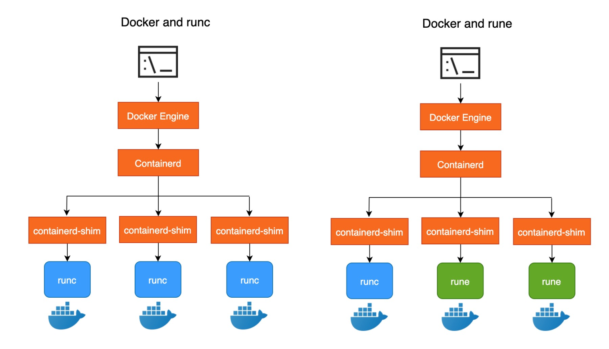

## 1. 机密计算简介

数据在整个生命周期有三种状态：At-Rest（静态）、In-Transit（传输中）和 In-Use（使用中）。

- At-Rest 状态下，一般会把数据存放在硬盘、闪存或其他的存储设备中。保护 At-Rest 状态的数据有很多方法，比如对文件加密后再存放或者对存储设备加密。

- In-Transit 是指通过公网或私网把数据从一个地方传输到其他地方，用户可以在传输之前对文件加密或者采用安全的传输协议保证数据在传输中的安全，比如HTTPS, SSL, TLS, FTPS等。

- In-Use 是指正在使用的数据。即便数据在传输过程中是被加密的，但只有把数据解密后才能进行计算和使用。也就意味着，如果数据在使用时没有被保护的话，仍然有数据泄露和被篡改的风险。而机密计算就是为了保护 In-Use 数据的安全的。

机密计算联盟给机密计算的定义是：机密计算是在一个**基于硬件的可信执行环境（TEE）**中保护数据执行计算。

机密计算的核心功能有：

- 保护 In-Use 数据的机密性。内存中的数据是被加密的，即便被攻击者窃取到内存数据也不会泄露数据；
- 保护 In-Use 数据的完整性。度量值保证了数据和代码的完整性，使用中有任何数据或代码的改动都会引起度量值的变化。
- 保护 In-Use 数据的安全性。相比普通应用，机密计算应用有更小的TCB（Trusted Compute Base）。意味着更小的攻击面，也意味着更安全。以 Intel SGX 为例，除了 CPU 和可信应用自身以外，其他软硬件的访问都是被拒绝的，包括操作系统、Hypervisor等。

支持TEE的硬件平台主要有3个：Intel SGX、ARM TrustZone 和 AMD SEV，他们有不同的应用场景和实现方式。

- ARM TrustZone 把硬件资源分为安全世界和非安全世界两部分，所有需要保密的操作在安全世界执行，其余操作在非安全世界执行，安全世界和非安全世界通过一个名为Monitor Mode的模式进行转换。典型的应用场景有移动支付、数字钱包等。
- AMD 利用 SEV（AMD Secure Encrypted Virtualizationn），SME（AMD Secure Memory Encryption）和SEV-ES（Secure Encrypted Virtualization-Encrypted State）等技术实现虚拟机的 Guest 内存加密和安全隔离。
- Intel SGX 是 Intel 提供的一组指令，用于提高应用的代码和数据的安全性。Intel SGX 程序由不可信代码和可信 Enclave 组成，敏感的代码和数据放入到 Enclave 中。Intel SGX 指令在一个特定的加密内存区域（EPC）中创建和执行 Enclave，该区域由开发者定义受限的入口和出口函数，有效防止数据泄露。

## 2. Inclavare Containers 的目标和价值

Inclavare Containers 是基于 Intel SGX 技术实现的机密计算。其目标是为业界提供面向机密计算场景的容器运行时引擎和安全架构。

目前社区有很多机密计算的开源项目，各个云厂商也开始布局机密计算。但在云原生场景中还有一些不足：

- **目前提供的技术的使用和开发门槛高**

以开发 Intel SGX 应用用例，用户需要向 Intel 申请商业证书，学习 Intel SGX 开发技能并对业务进行改造。相比传统开发方式，其使用和开发门槛很高，令很多开发者望而生畏。

- **机密计算容器化和对接 Kubernetes 的成本和复杂度高**

越来越多的用户开始拥抱云原生，即便用户掌握了机密计算的开发技能，让机密计算应用跑在容器里或者跑在 Kubernetes 里还要克服很多问题。比如如何在容器内加载 SGX 驱动，如何为容器合理分配 EPC 内存等。

- **服务提供商提供的技术方案相对单一**

现在很多服务提供商都提供了机密计算的技术方案，但方案总体来说比较单一，并不能完全满足用户上云的需求。
比如 Google 的 Asylo 和 Azure 的 OpenEnclave，他们是在 Intel SGX SDK 的基础上做了封装，以降低用户使用机密计算技术的成本。但这仍然需要用户掌握 Intel SGX 的开发技能，对用户而言仍然是有学习门槛的。
再比如 Occlum、GraphaneSGX 等 LibOS 技术，他们的目的是让用户在不改动代码或做改动很少的代码就能让应用运行在 Enclave 中。对用户而言不必再去学习复杂的机密计算的开发技术，但这只是解决了用户开发的问题，但仍然没有解决在容器中运行机密计算应用的问题。
总之，目前已有的机密计算技术方案相对单一，不能够完全满足用户不同场景的需求。

为了解决以上问题，Inclavare Containers 提供了基于机密计算的容器运行时，把机密计算技术和容器技术完美地结合在一起，其价值可概括为两点：

- 抹平机密计算的高使用门槛，为用户提供与普通容器一致的使用体感；
- 基于处理器提供的多种硬件安全技术，为用户的工作负载提供多种不同的 Enclave 形态，在安全和成本之间提供更多的选择和灵活性。

## 3. Inclavare Containers 架构

在介绍 Inclavare Containers 架构之前，先介绍一下架构中各个组件的作用：

### 3.1. 组件介绍

- **kubelet**：Kubernetes 集群中每个 Node 节点上运行的主要“节点代理”，负责与 Apiserver 的通信和管理节点上 Pod；

- **Containerd**：一个工业级标准的容器运行时，它强调简单性、健壮性和可移植性，Containerd 可以在宿主机中管理完整的容器生命周期：容器镜像的传输和存储、容器的执行和管理、存储和网络等；

- **shim-rune**：为容器运行时 rune 提供的 shim，主要负责管理容器的生命周期、把普通镜像转换成 TEE 镜像； 管理容器的生命周期，与 rune 配合完成容器的创建、启动、停止、删除等操作。

- **rune**：rune 是一个命令行工具，用于根据 OCI 规范在容器中生成和运行 Enclave。rune 是在 runc 代码基础上开发的，既可以运行普通 runc 容器也可以运行 Enclave 容器；

- **SGX LibOS**：SGX LibOS 是为了让普通应用在不做或做很少更改的情况下，就能够在 Intel SGX 上运行起来。目前 Inclavare Containers 支持的 LibOS 有 Occlum，Graphene-SGX 正在对接中；

- **语言 Runtime**：LibOS 对多语言的支持，比如 Occlum 中提供了 Golang 和 JDK 语言运行时；Enclave Runtime 除了配合 shim-rune 实现镜像转换以外，rune 还会用它在 Enclave 里加载和运行可信的应用。 为了方便 rune 和多种 Enclave Runtime 之间通信，Inclavare Containers 还抽象了一套 Enclave Runtime PAL API。不同 Enclave Runtime 各自基于自己的 Liberary OS（简称 LibOS）实现 API，默认的 Enclave Runtime 是 Occlum，Occlum 是一个基于 Intel SGX 的内存安全、多线程的 LibOS。 另外，用户也可以用合适的语言和 SDK （比如 Intel SGX SDK 或者 Rust SGX SDK）来实现自己的 Enclave Runtime PAL API。

- **PAL-API**：rune 和 LibOS 之间通信的接口。比如 pal_init 用于初始化 Enclave，pal_create_process 用于创建 Encalve；

- **liberpal.so**：是实现了 PAL-API 的 Linux 动态库，主要负责 rune 和 LibOS 的通信。

### 3.2. Docker 集群
由于 rune 是在 runc 代码基础上开发的，所以 rune 既可以创建 runc 容器，也可以创建 Enclave 容器。在 Docker 集群中，创建 runc 容器和创建 Enclave 容器的流程是完全一样的。

他们的区别在于镜像。普通 runc 容器镜像是不能创建 Enclave 的，需要用户按照 Enclave Runtime 的要求生成特殊的镜像。
以构建 Occlum 的业务镜像为例，其流程如下：

1. 用户向 Intel 申请商业许可的证书；
2. 用户开发应用。用户不需要掌握机密计算的知识，Occlum 提供了工具可以把普通应用转换为
可运行 Enclave 的文件，其中比较关键的一个文件是用来创建 Enclave 的 Enclave 动态库。需要注意的是：Occlum 有一些使用限制：
    - Occlum 支持的开发语言有：C、C++、Rust、Golang、OpenJDK11 和 Drangonwell；
    - Occlum 只支持 musll ibc，不支持 glic；
3. 用 sgx 工具和证书对 Enclave 动态库签名，生成签名的 Enclave 动态库；
4. 基于 Occlum 生成的文件构建镜像，构建成功后推入镜像仓库。

### 3.3 Kubernetes 集群
虽然 Docker 集群中能运行 Enclave 容器，但还有一些不足：

- 需要用户向 Intel 申请商业许可的证书；
- 需要用户在客户端按照 Enclave Runtime 要求开发镜像；
- 无法动态管理和调度 EPC；
- 容器编排能力弱，没有 Kubernetes 面向终态设计的容器管理方式。
为此，Inclavare Containers 提供了 shim-rune 用于在 Kubernetes 集群中创建 Enclave 容器，其工作流程如下：

1. kubelet 向 containerd 发起 CRI 请求；
2. containerd 把请求转发到 shim-rune；
3. shim-rune 通过容器环境变量 RUNE_CARRIER 来决定创建 runc 容器还是 Enclave 容器：
    - 如果环境变量 RUNE_CARRIER 不存在或者为空，则请求 rune 创建一个普通的 runc 容器
；
    - 否则 shim-rune 按照环境变量指定的 Enclave Runtime 把普通镜像转换成 TEE 镜像，然后请求 rune 创建 Enclave 容器。
4. 用二进制包为每个容器分别创建一个 rune 进程，该进程负责来创建容器，创建 runc 容器和 Enclave 容器的流程是不同的：
    - 创建 runc 容器：与 runc 创建 runc 容器的流程完全一样；
    - 创建 Enclave 容器：每种 Enclave Runtime 都会提供一个实现了 Enclave Runtime PAL API 的动态库 liberpal.so 。rune 先在 Host 上加载 liberpal.so，然后按照 runc 的方式创建容器，并在容器内启动 1 号进程 init-runelet ，init-runelet 接收到 rune 的请求后加
载并创建 Enclave。Encalve 包含一般包含两部分：LibOS 和 App/语言 Runtime。LibOS 是 Enclave Runtime 提供的用于支撑应用运行的操作系统库，App/语言 Runtime 是应用本身，有的语言也会有语言 Runtime，比如运行 OpenJDK 11 应用需要 JVM。
5. rune 进程退出，并把 Enclave 容器内 1 号进程的父进程设置为 shim-rune；
6. shim-rune 请求 rune 启动 Enclave。

对比 rune 在 Docker 集群和 Kubernetes 集群中的工作流程，其区别主要在于 Enclave 签名和构造TEE 镜像的过程，一个发生在客户端，一个发生在服务端。我们也可以认为这两种工作模式分别是客户端签名和服务端签名。

|谁提供证书 | 用 Enclave Runtime 制作镜像   |签名位置    |容器运行时 |
| :---: | :---: | :---: | :---: |
|客户端签名 |用户   |需要|  客户端  |docker|
|服务端签名|    服务提供商| 可能| 不需要|

## 4. Inclavare Containers的典型特点

总结下来，Inclavare Containers 的特点有：

- 将 IntelSGX 与容器生态结合，兼容 OCIRuntime 和 OCI 镜像标准，实现 Enclave 容器形态；
- 与 Kubernetes 生态无缝整合；
- 基于 LibraryOS 技术，改善 IntelSGX 引入的约束条件所带来的兼容性问题；
- 提供对高级语言 Runtime 的支持，进一步提升兼容性；
- 定义通用的 EnclaveRuntimePALAPI 规范，构建 EnclaveRuntime 生态。
