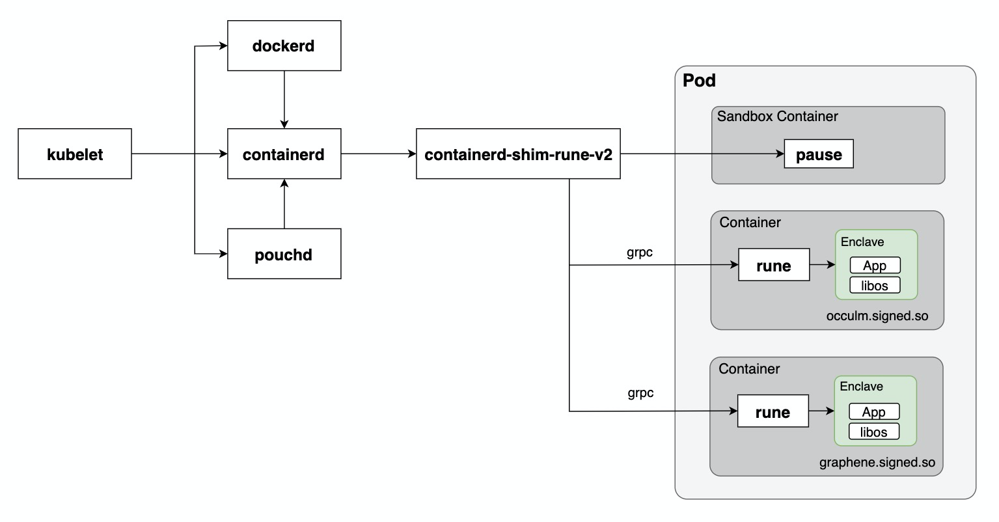
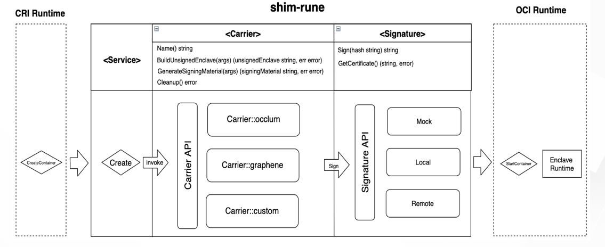
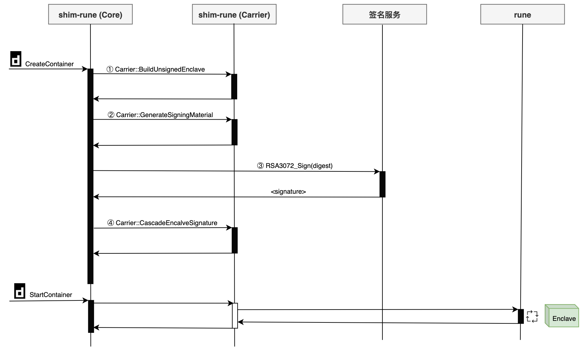

# containerd-shim-rune-v2

containerd-shim-rune-v2 is a shim for Inclavare Containers(runE).

## Introduction


## Carrier Framework
Carrier is a abstract framework to build an enclave for the specified enclave runtime (Occlum、Graphene ..) .



## Signature Framework



## Build requirements

Go 1.13.x or above.

## How to build and install

### Step 1: Build and install shim binary.
```bash
mkdir -p $GOPATH/src/github.com/alibaba
cd $GOPATH/src/github.com/alibaba 
git clone https://github.com/alibaba/inclavare-containers.git

cd shim
GOOS=linux make binaries
make install
ls -l /usr/local/bin/containerd-shim-rune-v2
```

### Step 2: Configuration

The Configuration file of Inclavare Containers MUST BE placed into `/etc/inclavare-containers/config.toml`

```toml
log_level = "info" # "debug" "info" "warn" "error"
sgx_tool_sign = "/opt/intel/sgxsdk/bin/x64/sgx_sign"

[containerd]
    socket = "/run/containerd/containerd.sock"
# The epm section is optional. 
# If the epm serivce is deployed, you can configure a appropriate unix socket address in "epm.socket" field, 
# otherwise just delete the epm section.
[epm]
    socket = "/var/run/epm/epm.sock"
[enclave_runtime]
    # The signature_method represents the signature method for enclave.
    # It can be "server" or "client", the default value is "server"
    signature_method = "server"
    [enclave_runtime.occlum]
        enclave_runtime_path = "/opt/occlum/build/lib/libocclum-pal.so"
        enclave_libos_path = "/opt/occlum/build/lib/libocclum-libos.so"
    [enclave_runtime.graphene]

```

Modify containerd configuration file(/etc/containerd/config.toml) and add runtimes rune into it.

```toml
#...
      [plugins.cri.containerd.runtimes.rune]
        runtime_type = "io.containerd.rune.v2"
#...
```

Add RuntimeClass rune into your kubernetes cluster.
```bash
cat <<EOF | kubectl create -f -
apiVersion: node.k8s.io/v1beta1
kind: RuntimeClass
metadata:
  name: rune
handler: rune
scheduling:
  nodeSelector:
    # Your rune worker labels.
    #alibabacloud.com/container-runtime: rune
EOF
```

## Run HelloWorld in kubernetes
```bash
cat <<EOF | kubectl create -f -
apiVersion: v1
kind: Pod
metadata:
  labels:
    run: helloworld-in-tee
  name: helloworld-in-tee
spec:
  runtimeClassName: rune
  containers:
  - command:
    - /bin/hello_world
    env:
    - name: RUNE_CARRIER
      value: occlum
    image: registry.cn-shanghai.aliyuncs.com/larus-test/hello-world:v2
    imagePullPolicy: IfNotPresent
    name: helloworld
    workingDir: /var/run/rune
EOF
```

## Third Party Dependencies

Direct Dependencies

| Name | Repo URL | Licenses |
| -- | :-------:   | :-------: |
|toml|github.com/BurntSushi/toml|MIT|
|cgroups|github.com/containerd/cgroups|Apache-2.0|
|containerd|github.com/containerd/containerd|Apache-2.0|
|go-runc|github.com/containerd/go-runc|Apache-2.0|
|typeurl|github.com/containerd/typeurl|Apache-2.0|
|gin|github.com/gin-gonic/gin|MIT|
|protobuf|github.com/gogo/protobuf|BSD-3-Clause|
|glog|github.com/golang/glog|Apache-2.0|
|protobuf|github.com/golang/protobuf|BSD-3-Clause|
|epm|github.com/inclavare-containers/epm|Apache-2.0|
|rune|github.com/inclavare-containers/rune|Apache-2.0|
|runtime-spec|github.com/opencontainers/runtime-spec|Apache-2.0|
|errors|github.com/pkg/errors|BSD-2-Clause|
|logrus|github.com/sirupsen/logrus|MIT|
|cobra|github.com/spf13/cobra|Apache-2.0|
|pflag|github.com/spf13/pflag|BSD 3-Clause|
|testify|github.com/stretchr/testify|MIT|
|sys|golang.org/x/sys|BSD-3-Clause|
|grpc|google.golang.org/grpc|Apache-2.0|
|apimachinery|k8s.io/apimachinery|Apache-2.0|