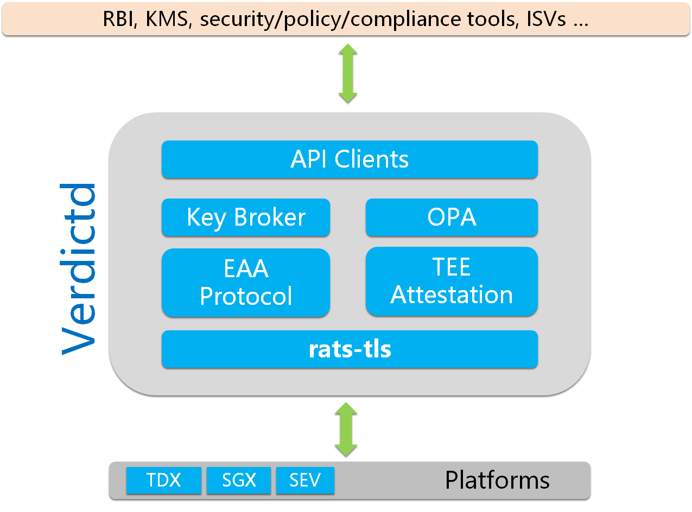
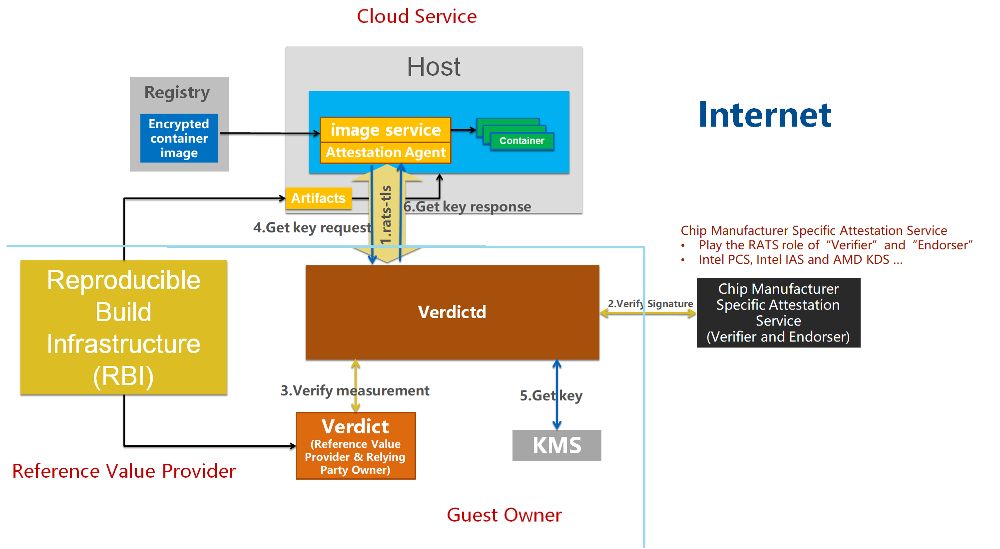

Building a trusted, secure, and controlled cloud with hardware root of trust.

# Introduction

Cloud computing has become an inevitable trend for consumers, enterprises, and other entities. However, security risks in the cloud are still the #1 barrier for broader cloud adoption.

HW-TEE-based cloud security solutions provide a higher level of protection as compared to software-only security measures. 
There are many HW-TEE security technologies such as Intel SGX, Intel TDX, and AMD SEV, which can be used to secure customers' data.
But customers still encounter the following problems during the deployment of their containers into the HW-TEE-based cloud environments.
- How to identify if the server can be trusted (The target HW-TEE environment wasn't forged by a malicious Hacker)?
- How to ensure customers' container content wasn't tampered with by malicious hackers before loading into HW-TEE-based cloud environment?
- How to ensure the running programs inside target HW-TEE are as expected? Because these programs may be deployment by Cloud Service Provider (CSP) and should be passed source code's audit.

These complex problems can be resolved by HW-TEE's remote attestation technologies. But remote attestation's mechanism and deployment are complicated to general customers.
Enclave Attestation Architecture(EAA) Verdictd was built to simplify the deployment of the remote attestation procedures. It integrates these different platforms' remote attestations into general service.

# Trusted Execution Environment

A Trusted Execution Environment (TEE) provides a computer secure area where code and data can be loaded with the assurance that their confidentiality and integrity are protected. 
TEEs have various applications in areas where the confidentiality of the data and the integrity of the code are of the highest importance. 
One example of TEE usage is the protection of sensitive secrets like cryptographic keys and authentication strings. 
These secrets can be preserved within a TEE, ensuring that they never get exposed to software that is outside of the TEE. 
Operations involving these secrets can be performed within the TEE, removing the need to ever extract the secrets outside of the TEE. 
Another example is the processing of data with privacy concerns. This is often the case in financial, healthcare, and artificial intelligence (AI) applications. 
Putting sensitive operations inside a TEE allows organizations to support business processes without compromising the privacy expectations of their customers.

# Overview

EAA Verdictd is a remote attestation implementation comprising of a set of building blocks that utilize Intel/AMD Security features to discover, attest, and enable critical foundation security and confidential computing use-cases. 
It applies the remote attestation fundamentals and standard specifications to maintain a platform data collection service and an efficient verification engine to perform comprehensive trust evaluations. 
These trust evaluations can be used to govern different trust and security policies applied to any given workload.

The bottom part of the architecture diagram indicates the various HW-TEE environments that are supported by Verdictd.
It implements a GRPC server that client can use to set Verdictd's configurations and OPA policy files.
Currently, it relies on [rats-tls](https://github.com/alibaba/inclavare-containers/tree/master/rats-tls) to execute remote attestation procedures and build a secure & trusted channel with an HW-TEE environment.

## Modular design with scalability

In order to maximize Verdictd's scalability, all functionalities were implemented as separately static RUST modules. Each module can be added or excluded during the compiling stage.

# Work process

The below diagram depicts the whole potential working process of EAA.

- EAA's Attestation Agent(AA) will fetch HW-TEE signed evidence from the HW-TEE environment and send it to EAA's Verdictd to verify when remote attestation is needed.
- Verdictd will execute the following inspections after receiving evidence from AA:
  - Invoke Chip Manufacturer Specific Attestation Service to check the evidence's signature to ensure the AA's running environment can be trusted (truly HW-TEE).
  - Verify the evidence's measurement value to ensure the HW-TEE running program's content hasn't been tampered or the programs are as expected.
- If all these verifications are passed successfully, Verdictd can conclude:
  - The cloud environment can be trusted (a truly HW-TEE environment).
  - The running program's content hasn't been tampered with if it was deployed by the customer self.
  - The running programs are all as expected if they were deployed by CSP.
- An security & trusted channel is built between Verdictd and AA after remote attestation successfully. So AA can send EAA protocol's command via this channel such as getKey() request.